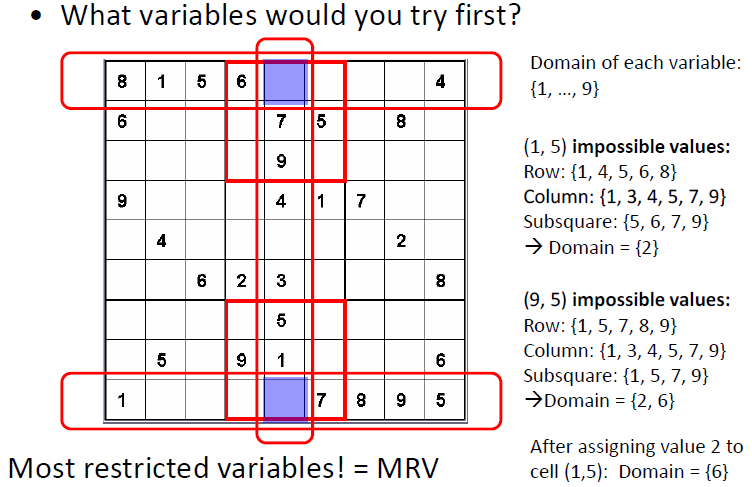

 

[TOC]

# Search

## formalization（形式化）

1. Formulate a **state space** (形式化状态空间)

   抽象真实问题

2. Formulate **actions** （形式化动作）

   allow one to move between different states

3. Identify the **initial state** （确定初始状态）

4. Identify the **goal** or **desired condition** （确定目标）

5. Formulate heuristic （形式化启发式）

Example：

# Property of Search 搜索的属性

- **Completeness 完备性**: will the search always find a solution if a solution exists?
- **Optimality 最优性** : will the search always find the least cost solution? (when actions have costs)
- **Time complexity 时间复杂度**: what is the maximum number of nodes than can be expanded or generated?
- **Space complexity 空间复杂度**: what is the maximum number of nodes that have to be stored in memory?

# Uninformed Search 无信息搜索

## Breadth first 宽度优先

将继承者放置到边界末端

example:

完备性、最优性：Yes

从小到大寻求方案，直到找到答案为止

最大继承数：b

最小解决方案步数：d

时间复杂度：$1 + b + b^2 + \cdots + b^d + b(b^d - 1) = O(b^{d+1})$

空间复杂度：$b(b^d-1) = O(b^{d+1})$

## Depth first 深度优先

将继承者放置到边界前端

example:

完备性：

最优性：No

最大继承数：b

最小解决方案步数：d

时间复杂度：$O(b^m)$ m是状态空间中最长的路径；若m远远大于d则非常糟糕，但若有多个解往往会比较快

空间复杂度：$O(bm)$ 线性，每次仅探索一条路径

## Uniform cost 一致代价搜索

边界顺序由代价(cost)决定，永远扩展代价最小的路径

完备性、最优性：Yes

C*：最优结果的代价  $\epsilon$：每一步的代价

时间、空间复杂度：$O(b^{C^* / \epsilon+1})$

## Depth-limited search 深度受限搜索

设置的深度：L

## Iterative deepening search 迭代加深搜索

初始令L=0，并逐渐增大L

时间复杂度：$O(b^d)$

空间复杂度：$O(bd)$

## Bidirectional search 双向搜索

#### 无信息搜索总结

(BFS中的空间和时间改为$O(b^{d+1})$)

# path checking / cycle checking 路径检测/环检测

## 路径检测

通向c的路径：$<n_1, \cdots, n_k, c>$

则c不能与$n_i$相同

## 环检测

在整个探索过程中记录结点，确保扩展的结点c不与之前任何状态中的结点相同

## 总结

# Heuristic search 启发式搜索

idea: 得到启发式函数$h(n)$，预测从当前节点n到目标节点的花费

## Greedy best-first search (Greedy BFS) 最佳优先搜索

用h(n)对边界中的结点进行排序，优先获取low cost的解

该方法忽略了到达n的cost

## A* Search A*搜索

evaluation function 评估函数：$f(n) = g(n) + h(n)$

$g(n)$是到达结点n的路径花费

$h(n)$是启发式估计从结点n到达终点的花费

$f(n)​$是对经过结点n到达终点的估计

### Admissible 可接纳性

$h^*(n)$是从n到达终点的最佳路径的花费

$h(n)$是可容许的如果对于所有节点n都有$h(n) \leq h^*(n)$

Admissible 可容纳的启发式低估真正的花费

$h(g) = 0$，如果n不能到达终点则$h(n) = \infty$

**可接纳性 $\rightarrow $最佳性 Admissibility implies optimality**

### Consistency (Monotonicity) 一致性、单调性

$h(n)$**一致的/单调的**，如果对于任意结点$n1,n2$都有$h(n1 \leq c(n1 \rightarrow n2) + h(n2))$

**一致性 $\rightarrow $ 可接纳性 Consistency implies admissibility**

单调性保证能在第一次到达某结点就是最佳路径

若没有单调性，则需要记住之前路径的花费

性质：

1. 

   f(n)单调递增

2. 

   若n2在n1后出现，则$f(n_1) \leq f(n_2)$

3. 

   任何f花费小于f(n)的结点必然已经扩展过

4. 

   第一次扩展到的结点就是最短路径

5. 在单调性的前提下，换检测保证了最佳性

## IDA*  迭代加深A*算法

迭代cutoff value为f-value，而不是原来的L（深度）

边界中以f(n)的大小来排序

放松问题中的最优花费是对于原问题可接受的启发式

# Game tree search 博弈树搜索

## basic definition

- Player: A(Max), B(Min)

- State: S

- Initial state: I

- Terminal state: T

- Successors
- Utility(效益), Payoff function: V

## MiniMax Strategy

## Alpha-beta pruning

Two types of pruning:

- pruning of max nodes (α-cuts)
- pruning of min nodes (β-cuts)

### Alpha cut

## Beta cut

## 总结

当 $\beta \leq \alpha$时，进行剪枝

Minimax 需要探索 $O(b^D)$个结点，而alpha-beta剪枝需要探索$O(b^{D/2})$个结点

# CSP (Constraint satisfaction problem)约束满足问题

## Formalization 形式化

A CSP consists of:

- A set of variables: V1, … ,Vn
- Each variable has a domain: Dom[Vi] ($V_i = d \iff d \in Dom[V_i]$)
- A set of constraints: C1, … ,Cm   e.g. C(V1,V2,V4)

goal: 寻找满足条件的解，使得各个变量都有取值

## backtracking 回溯算法

启发式应用于挑选变量和挑选值：

## Forward checking 向前检测

检查那些只含有一个未实例化变量的约束，去除那个变量所有违反约束取值

同时要记住，每一个值是在哪一步被去除的

### MRV (Minimum Remaining Values Heuristics) 最小剩余启发式

先执行值域较小的变量，当一个变量只有一个取值时，立即执行

## GAC (Generalized Arc Consistency) 整体边一致

Some definition:

- C(X,Y) is consistent $\iff$ $\forall x, \exists y \ 满足C$

- C(V1,V2, … ,Vn) 关于Vi is GAC $\iff$ $\forall Vi, \exists V1,...Vi-1,Vi+1,...Vn \ 满足C$

- A constraint(C) is GAC $\iff$ 关于它的任何变量都是GAC的

- A CSP is GAC $\iff$ 所有限制(C)都是GAC的

如果对于变量V，取值d不能得到一个解，这说d是arc inconsistent（边不一致的）

GAC检查的过程需要不断的循环，因为一个定义域改变可能引起其它定义域变化

GAC必须在每个节点都检查所有限制(C)

Example:http://www.cs.toronto.edu/~fbacchus/csc384/Lectures/Tutorial3_CSP.pdf

[回到顶部](#top)