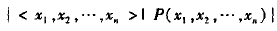
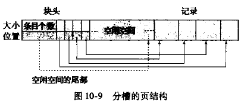

<span id="top"></span> 
[TOC]

# 第一章 引言

### 1.1

数据库管理系统(DataBase-Management System, DBMS)

​	主要目标：提供一种**方便、高效地**存取数据库信息的途径

文件处理系统中存储组织信息的主要弊端：
- 数据的冗余和不一致
- 数据访问困难
- 数据孤立
- 完整性问题
- 原子性问题
- 并发访问异常
- 安全性问题

### 1.3 数据视图
#### 1.3.1 数据抽象
- 物理层

  最低层次的抽象，描述数据是怎样存储的

- 逻辑层

  逻辑层用户不必知道物理层结构，保证了*物理数据独立性*

- 视图层


#### 1.3.2 实例和模式
**实例(instance)**：特定时刻数据库中的信息集合

**模式(schema)**：数据库的总体设计（不频繁发生改变）

**物理模式**：在物理层描述数据库的设计

**逻辑模式**：在逻辑层描述数据库的设计

#### 1.3.3 数据模型
**数据模型**：数据库结构的基础
- **关系模型**

  用表的集合来表示数据和数据间的关系

- **实体-联系模型(E-R)**

  现实世界由一组称作实体的基本对象以及这些对象间的联系构成

- 基于对象的数据模型

- 半结构化数据模型

### 1.4 数据库语言

数据定义语言(Data-Definition Language)：定义数据库模式

数据操纵语言(Data-Manipulation Language)：表达数据库的查询和更新

#### 1.4.1 数据操纵语言(DML) <span id="1.4.1"></span> [返回](#2.5)

- 过程化DML：要求用户指定需要什么数据以及如何获得这些数据
- 声明式DML（非过程化DML）：只要求用户指定需要什么数据

**查询(query)**：对信息进行检索的语句
#### 1.4.2 数据定义语言(DDL)
数据库中的数据值必须满足某些**一致性约束**
- 域约束

  每个属性都有值域

- 参照完整性

  一个关系中属性集上的取值也在另一关系的某一属性集的取值中出现

- 断言

  数据库需要时刻满足的某一条件

- 授权

  对用户加以区别（读权限、插入权限、更新权限、删除权限）

DDL的输出放在**数据字典**中，数据字典包含了**元数据**，元数据是关于数据的数据

### 1.5 关系数据库

#### 1.5.1 表


#### 1.5.2 数据操纵语言(DML)


#### 1.5.3 数据定义语言(DDL)


### 1.6 数据库设计

数据库设计的主要内容是数据库模式的设计
#### 1.6.1 设计过程
1. 制定出用户需求的规格文档
2. 概念设计阶段，将需求转换为数据库的概念模式
3. 逻辑设计阶段
4. 物理设计阶段
#### 1.6.3 实体-联系模型(E-R模型)
实体通过**属性**集合来描述

**联系**是几个实体之间的关联

**实体集、联系集**：同一类型所有 *实体/联系* 的集合


#### 1.6.4 规范化
目标：

​	1、没有不必要的冗余

​	2、能轻易地检索数据

使用**函数依赖**设计**范式**

### 1.7 数据存储和查询
数据库系统的功能部件可分为 *存储管理器* 和 *查询处理部件*
#### 1.7.1 存储管理器
存储管理部件包括：
- 权限及完整性管理器
- 事务管理器
- 文件管理器
- 缓冲区管理器

数据结构：
- 数据文件：存储数据库本身
- 数据字典：存储关于数据库结构的元数据（数据库模式）
- 索引：提供对数据项的快速访问

#### 1.7.2 查询处理器
查询处理器组件包括：
- DDL解释器：解释DDL语句并将定义记录在数据字典中
- DML编译器：将查询语言翻译为一个执行方案
- 查询执行引擎：执行由DML编译器产生的低级指令

### 1.8 事务
**事务**是数据库应用中完成单一逻辑功能的操作集合

其具有*原子性*、*一致性*、*持久性*

**恢复管理器**保证数据库系统的原子性和持久性

**并发控制管理器**控制并发事务间的相互影响，保证数据库的一致性

**事务管理器**包括并发控制管理器和恢复管理器

### 1.12 数据库用户和管理员
#### 1.12.1 数据库用户
数据库系统的用户可以分为四种不同类型：
- 无经验的用户
- 应用程序员
- 老练的用户
- 专门的用户
#### 1.12.2 数据库管理员
数据库管理员(DataBase Administrator, DBA)的作用包括：
- 模式定义
- 存储结构及存取方法定义
- 模式及物理组织的修改
- 数据访问授权
- 日常维护

### 1.14 总结
见书本P18


# 第二章 关系模型介绍

### 2.1 关系数据库的结构
关系数据库由**表**的结合构成

**关系** 用来指代表，**元组** 用来指代行，**属性** 用来指代表中的列


**关系实例**表示一个关系的特定的实例，即所包含的一组特定的行

**域**：关系中的属性允许取值的集合

若域中元素被看作是不可再分的单元，则域是**原子的**

**空值(null)**：一个特殊的值，表示值未知或不存在

### 2.2 数据库模式

**数据库模式**是数据库的逻辑设计

**数据库实例**是特定时刻数据库中数据的一个快照

**关系模式**对应与程序设计中的类型定义


department关系的模式：

### 2.3 码

**超码**：一个或多个属性的集合，可以使我们在一个关系中唯一地标识一个元组

**候选码**：最小的超码

**主码**：被设计者选中用来在一个关系中区分不同元组的***候选码***

r$_1$在属性中包括r$_2$的主码，这个属性在r$_1$上被称作参照r$_2$的**外码**

关系r$_1$称为外码依赖的**参照关系**，关系r$_2$称作外码的**被参照关系**

**参照完整性约束**：要求参照关系的元组在特定属性上的取值等于被参照关系中某个元组在该属性上的取值

### 2.4 模式图 


### 2.5 关系查询语言

**查询语言**：请求获取数据库信息的语言

*过程化语言、非过程化语言* [见1.4.1](#1.4.1) <span id="2.5"></span>

### 2.6 关系运算

**自然连接**：两个关系上所匹配的元组在两个关系共有的所有属性上取值*相同*

*笛卡尔积*运算从两个关系中合并元组，结果包含两个关系元组的*所有对*，不论属性值是否匹配

第6章将详细介绍关系代数，因此此处不再概述

### 2.7 总结

见P28


# 第三章 SQL

### 3.1 SQL查询语言概览

SQL语言有以下几个部分：

- 数据定义语言(DDL)：定义关系模式、删除关系、修改关系模式
- 数据操纵语言(DML)：从数据库中查询信息、在数据库中插入元组、删除元组、修改元组
- 完整性：完整性约束
- 视图定义
- 事务控制
- 嵌入式SQL和动态SQL
- 授权： DDL可以定义对关系和视图的访问权限

### 3.2 SQL数据定义

#### 3.2.2 基本模式定义

**create table**命令的通用形式：


**create table**命令的例子：


三个基本的完整性约束：

- primary key$(A_1,A_2, \cdots )$：属性 $(A_1,A_2, \cdots )$ 构成关系的主码
- foreign key$(B_1,B_2, \cdots )$ references s：属性 $(B_1,B_2, \cdots )$ 上的取值必须对应于关系s中某元组在主码属性上的取值
- not null：该属性上不允许空值

#### 3.3 SQL查询的基本结构

**自然连接**运算作用于两个关系，并产生一个关系作为结果。自然连接只考虑哪些在两个关系模式中都出现的属性上取值相同的元组对。

```mysql
select name,course_id
from instructor natural join teachers;
```

### 3.4 附加的基本运算

#### 3.4.1 更名运算

```mysql
select distinct T.name
from instructor as T, instrctor as S
where T.salary > S. salary and S.dept_name = 'Biology';
```

这种用**as**实现的重命名，被称作**表别名**或者是**相关名称**

#### 3.4.2 字符串运算

```mysql
select dept_name
from department
where building like '% Watson%'; 
-- 找出任意所在建筑名称中包含子串'Watson'的所有系名
```

字符串使用**like**操作符来实现模式匹配。用两个特殊字符来描述模式：

- **百分号(%)**：匹配任意字串
- **下划线(_)**：匹配任意一个字符

### 3.5 集合运算

**union, intersect, except**运算分别对应于集合论中的$\cup(并) \cap(交), -(差)$运算


### 3.6 空值

空值给关系运算带来了特殊的问题，包括算数运算、比较运算和集合运算

- 算术运算

  如果算数表达式任一输入为空，则该算数表达式结果为空

- 比较运算

  1 < null = unknown

- 布尔运算

  | 运算符  | true R unknown | false R unknown | unknown R unknown |
  | ------- | -------------- | --------------- | ----------------- |
  | **and** | unknown        | false           | unknown           |
  | **or**  | true           | unknown         | unknown           |

  **not unknown** = unknown

### 3.7 聚集函数

**聚集函数**是以值的一个集合为输入、返回单个值的函数

常见聚集函数：avg, min, max, sum, count

#### 3.7.2 分组聚集

```mysql
select dept_name, avg(salary) as avg_salary
from instructor
group by dept_name;
-- 找出每个系的平均工资
```

查询结果：

出现在**select**语句中但没有被聚集的属性只能是出现在**group by**子句中的那些属性

#### 3.7.3 having子句

**having**子句中的谓词在形成分组后才起作用
```mysql
select dept_name, avg(salary) as avg_salary
from instructor
group by dept_name
having avg(salary) > 42000
-- 找出每个平均工资大于42000的系
```

### 3.8 嵌套子查询

子查询是嵌套在另一个查询中的**select-from-where**表达式。

#### 3.8.1 集合成员资格

连接词**in/not in**测试元组是否是集合中的成员


#### 3.8.2 集合的比较

集合的比较需要用到比较运算符以及**some/all**关键词


#### 3.8.3 空关系测试

**exists**结构在作为参数的子查询非空时返回**true**值


#### 3.8.5 from子句中的子查询

任何**select-from-where**表达式返回的结果都是关系，因而可以被插入到另一个**select-from-where**中任何关系可以出现的位置


#### 3.8.6 with子句

**with**子句提供定义临时关系的方法，这个定义只对包含**with**子句的查询有效


### 3.9 数据库的修改

#### 3.9.1 删除

```mysql
delete from r
where P;
```

#### 3.9.2 插入

```mysql
insert into course
values('CS-437','C++','CS',4)
```

#### 3.9.3 更新

```mysql
update instructor
set salary = salary * 1.05;
```

### 3.10 总结

见P57


# 第4章 中级SQL

### 4.1 连接表达式

#### 4.1.2 外连接

外连接的三种形式：

1. **左外连接(left outer join)**：只保留出现在左边的关系中的元组
2. **右外连接(right outer join)**：只保留出现在右边的关系中的元组
3. **全外连接(full outer join)**：保留出现在两个关系中的元组


**on**和**where**在外连接中的表现是不同的，**on**条件是外连接声明的一部分，但**where**子句却不是

### 4.2 视图

**视图**：不是逻辑模型的一部分，但作为虚拟关系对用户可见

#### 4.2.1 视图定义

**create view**命令的格式为：

```mysql
create view v as <query expression>;
-- <query expression> 可以是任何合法的查询表达式，v表示视图名
```

#### 4.2.2 SQL查询中使用视图

在查询中，视图名可以出现在关系名可以出现的任何地方。


#### 4.2.3 物化视图

**物化视图**：如果用于定义视图的实际关系改变，视图也跟着修改

保持物化视图一直在最新状态的过程称为*物化视图维护*或*视图维护*

#### 4.2.4 视图更新

一个视图是**可更新的**，如果其满足以下条件：

- from子句中只有一个数据库关系
- select子句只包含关系的属性名，不包含表达式、聚集或distinct声明
- 任何没有出现在select子句中的属性都没有not null约束，同时也不是主码的一部分
- 查询中不含有group by或having子句


### 4.3 事务

**事务**由查询和更新语句的序列组成

事务结束标志：

- **Commit work**：提交当前事务
- **Rollback work**：回滚当前事务

### 4.4 完整性约束

#### 4.4.2 not null 约束

**not null**声明禁止在该属性上插入空值

#### 4.4.3 unique 约束

`unique(A1,A2, ... ,Am)`

unique声明指出属性A1,A2,…Am形成了一个候选码

#### 4.4.4 check 子句

**check(P)**子句指定一个谓词P，关系中的每个元组都必须满足谓词P

```mysql
create table department
( dept_name varchar (20),
budget int,
check (budget>0));
```

#### 4.4.5 参照完整性

**参照完整性**：保证在一个关系中给定属性集上的取值也在另一关系的特定属性集的取值中出现

#### 4.4.7 断言

一个**断言**就是一个谓词，它表达了我们希望数据库总能满足的一个条件

断言为如下形式：`create assertion <assertion-name> check <predicate>;`

### 4.5 SQL的数据类型与模式

#### 4.5.2 默认值

SQL允许为属性指定默认值


#### 4.5.3 创建索引

**索引**：创建在关系的属性上，允许数据库高效地找到关系中那些在属性上取给定值的元组，而不用扫描关系中的所有元组

创建索引示例：`create index studentID_index on student(ID);`

### 4.6 授权

对数据的授权包括：

- 授权读取数据
- 授权插入新数据
- 授权更新数据
- 授权删除数据

每种类型的授权都称为一个**权限**

SQL包括select, insert, update, delete权限

grant语句用来授予权限，revoke语句用来收回权限

### 4.7 总结

见P85


# 第五章 高级SQL

### 5.3 触发器

**触发器**是一条语句，当对数据库做修改时，它自动被系统执行

设置触发器机制的要求：

- 指明什么条件下执行触发器
  - 一个引起触发器被检测的事件
  - 一个触发器执行必须满足的条件
- 指明触发器执行的动作


# 第六章 形式化关系查询语言

### 6.1 关系代数

关系代数是一种*过程化*查询语言

关系代数的基本运算有：*选择、投影、并、集合差、笛卡尔积、更名*

其它运算：*集合交、自然连接、赋值*

#### 6.1.1 基本运算

一元运算：*选择、投影、更名*

二元运算：*并、集合差、笛卡尔积*

##### 6.1.1.1 选择运算

**选择($\sigma$)**运算选出满足给定谓词的元组

通常，我们允许在选择谓词中进行比较，使用的是：$=, \neq, <, \leq, >, \geq$

另外可以用连词$and(\and), or(\or), not(\neg)$将多个谓词合并为一个较大的谓词


##### 6.1.1.2 投影运算

**投影($\Pi$)**运算返回作为参数的关系


##### 6.1.1.3 关系运算的组合

由于关系代数运算的结果类型仍为关系，因此可以把多个关系代数运算组合成一个**关系代数表达式**


##### 6.1.1.4 并运算


要使**并**运算**$r \cup s$**有意义（*相容*），必须满足以下两个条件：

1. 关系r和s必须是同元的，即它们的属性数目必须相同
2. 对所有的i，r的第i个属性的域必须和s的第i个属性的域相同

##### 6.1.1.5 集合差运算

用$-$表示**集合差**运算表示在一个关系中而不在另一个关系中的那些元组


集合差运算必须在*相容*的关系间进行（与并运算类似），即关系同元且属性的域相同

##### 6.1.1.6 笛卡尔积运算

**笛卡尔积($\times$)**运算可以将任意两个关系的信息组合在一起


###### 6.1.1.7 更名运算

**更名($\rho$)**运算可以给关系赋予名字


#### 6.1.3 附加的关系代数运算

##### 6.1.3.1 集合交运算

**集合交($\cap$)**运算：$r  \cap s = r - ( r - s )$


##### 6.1.3.2 自然连接运算

r和s的**自然连接**表示为$r \Join s$


##### 6.1.3.3 赋值运算

**赋值($\leftarrow$)**运算可以给临时关系变量赋值

$r \Join s​$可以表示为：

##### 6.1.3.4 外连接运算

**外连接**运算是连接运算的扩展，它在结果中创建带空值的元组，以此来保留在连接中丢失的那些元组

外连接运算有三种形式：

- 左外连接：$=\Join \leftouterjoin$ 

  取出左侧关系中所有与右侧关系的任一元组都不匹配的元组，用空值填充所有来自右侧关系的属性

- 右外连接：$\Join=\rightouterjoin $

  与左外连接相反

- 全外连接：$= \Join = \fullouterjoin$

  既做左外连接也做右外连接


#### 6.1.4 扩展的关系代数运算

##### 6.1.4.1 广义投影

**广义投影**允许在投影列表中使用算数运算和字符串函数来对投影进行扩展


##### 6.1.4.2 聚集

**聚集函数**：输入值的一个汇集，将单一值作为返回值


**聚集运算$\mathscr{G}$**(花体g)通常的形式：


### 6.2 元组关系演算

代数表达式产生过程序列，而*元组关系演算*是**非过程化**的

查询表达式为：$\{ t|P(t) \}$

#### 6.2.1 查询示例


#### 6.2.2 形式化定义

如果元组变量不被$\exist$或$\forall$修饰，这称为*自由变量*，否则称为*受限变量*


元组关系演算的公式由*原子*构成，原子可以是一下形式之一：

- $s \in r$：s是元组变量，r是关系
- $s[x] \ \Theta\ u[y]$：其中s和u是元组变量，x和y是属性，$\Theta$是比较运算符（如：<）
- $s[x] \ \Theta \  c$：其中s是元组变量，x是属性，c是常量，$\Theta$是比较运算符

#### 6.2.3 表达式的安全性

P的**域dom(P)**是P所引用的所有值的集合


### 6.3 域关系演算

关系演算的另一种形式称为**域关系演算**，使用从属性域中取值的域变量，而不是整个元组的值

#### 6.3.1 形式化定义

域关系演算中的表达式形式：（$x_n$代表域变量）

域关系演算中的原子具有如下形式之一：


#### 6.3.2 查询的例子


### 6.4 总结

见P140


# 第七章 数据库设计和E-R模型

### 7.1 设计过程概览

#### 7.1.1 设计阶段

- 完整刻画用户的数据需求
- 选择数据模型
- **概念设计阶段**
- 完善概念模式，指明功能需求（**功能需求规格说明**）
- **逻辑设计阶段、物理设计阶段**

#### 7.1.2 设计选择

*实体*指示所有可以明确的个体

设计数据库模式时，必须避免两个主要缺陷：

- **冗余**：不好的设计可能会导致重复信息

  最大的问题是，当对一条消息进行更新时，这条消息的拷贝可能会与其不一致

- **不完整**：某些方面可能难以甚至无法建模

### 7.2 实体-联系模型

E-R数据模型采用三个基本概念：实体集、联系集、属性

#### 7.2.1 实体集

**实体**是现实世界中可区别于所有其他对象的一个“事物”或“对象”

**实体集**是相同类型具有相同性质（属性）的一个实体集合

实体通过一组**属性**来表示

每个实体的每个属性都有一个**值**

#### 7.2.2 联系集

**联系**是指多个实体间的相互关联

**联系集**是相同类型联系的集合

实体集$E_1, E_2, \cdots , E_n$**参与**联系集R

实体在联系中扮演的功能称为实体的**角色**

联系也可以具有**描述性属性**

参与联系集的实体集的数目称为联系集的**度**（二元联系集的度为2，三元联系集的度为3）

#### 7.2.3 属性

**域（值集）**：每个属性可取值的集合

属性类型：

- **简单**和**复合**属性：

  复合属性可以划分为更小的部分（其它属性）

  

- **单值**和**多值**属性：

  单值属性：一个属性只有单独的一个值

  多值属性：一个属性可能对应于一组值

- **派生属性**：

  这类属性的值可以从别的相关属性或实体派生出来

### 7.3 约束

#### 7.3.1 映射基数

**映射基数**：表示一个实体通过一个联系集能关联的实体的个数

+ 一对一
+ 一对多
+ 多对一
+ 多对多


#### 7.3.2 参与约束

如果实体集E中的每个实体都参与到联系集R的至少一个联系中，则称E在R中的参与是**全部**的

#### 7.3.3 码

一个实体的属性的值必须可以*唯一*标识该物体

联系集的主码结构依赖于联系集的映射基数

### 7.5 实体-联系图

**E-R图**可以图形化标识数据库的全局逻辑结构

#### 7.5.1 基本结构


#### 7.5.2 映射基数


#### 7.5.3 复杂的属性


#### 7.5.6 弱实体集

**弱实体集**：没有足够的属性以形成主码的实体集

**强实体集**：有主码的实体集

弱实体集必须与另一个称作**标识**或**属主实体集**的实体集关联才能有意义

弱实体集**存在依赖**于标识实体集；标识实体集**拥有**它所标识的弱实体集

弱实体集与其标识实体集相连的联系称为**标识性联系**

弱实体集的**分辨符**可以区分其中的实体


#### 7.5.7 大学的E-R图


### 7.7 实体-联系设计问题

#### 7.7.1 用实体集还是用属性


常见错误：用一个实体集的主码作为另一个实体集的属性，而不是用联系

#### 7.7.2 用实体集还是用联系集


原则：当描述发生在实体间的行为时采用联系集

#### 7.7.3 二元还是n元联系集

数据库中的联系通常都是二元的，一些看来非二元的联系也可以用多个二元联系表示

#### 7.7.4 联系属性的布局

一对一或一对多联系集的属性可以放到一个参与该联系的实体集中，而不是放到实体集中


### 7.8 扩展的E-R特性

扩展E-R特性：特化、概化、高层和低层实体集属性继承、聚集

#### 7.8.1 特化

在实体集内部进行分组的过程称为**特化**（e.g. person->employee,student）

重叠特化：一个实体集可能属于多个特化实体集

不相交特化：一个实体集属于至多一个特化实体集


#### 7.8.2 概化

实体集间包含相同的属性可以通过**概化**来表达，概化是高层实体集与一个或多个实体集间的包含关系

高层与低层实体集也可以分别称作**超类**和**子类**

**概化**本质上是**特化**的逆过程

#### 7.8.3 属性继承

由特化和概化所产生的高层和低层实体的一个重要特性是**属性继承**

#### 7.8.4 概化上的约束

判定哪些实体能成为给定低层实体集的成员的条件：

- **条件定义的**：成员资格的确定基于实体是否满足一个显式的条件或谓词
- **用户定义的**：低层实体集由用户将实体指派给某个实体集

一个概化中一个实体是否可以属于多个低层实体集：

- **不相交**：一个实体至多属于一个低层实体集
- **重叠**：同一个实体可以同时属于多个低层实体集

对概化的**完全性约束**：

- **全部概化**或**特化**：每个高层实体必须属于一个低层实体集
- **部分概化**或**特化**：一些高层实体不属于任何低层实体集

#### 7.8.5 聚集

E-R模型的一个局限性在于它不能表达联系间的联系

**聚集**是一种抽象，通过这种抽象，联系被视为高层实体


### 7.11 总结

见P176


# 第八章 关系数据库设计

### 8.2 原子域和第一范式

一个域是**原子的**，如果该域的元素被认为是不可分的单元

关系模式R属于**第一范式（1NF），**如果R的所有属性的域都是原子的

### 8.3 使用函数依赖进行分解

属性集：$\alpha$

关系模式：r(R)

超码：K

一个关系模式是一个属性集，但是并非所有的属性集都是模式

#### 8.3.1 码和函数依赖

一个关系的满足所有这种现实世界约束的实例，称为关系的**合法实例**

R的子集K是r(R)的**超码**的条件：在关系r(R)的任一合法实例中，对于r的实例中的所有元组对$t_1$和$t_2$总满足，若$t_1 \neq t_2$，则$t_1[K] \neq t_2[K]$

考虑一个关系模式r(R)，令$\alpha \subseteq R$ 且 $\beta \subseteq R$：

满足**函数依赖$\alpha \rightarrow \beta$**的条件是：

- 对实例中所有元组对$t_1$和$t_2$，若$t_1[\alpha] = t_2[\alpha]$，则$t_1[\beta] = t_2[\beta]$
- 如果在r(R)的每个合法实例中都满足函数依赖$\alpha \rightarrow \beta$，则函数依赖在模式r(R)上**成立**

两种方式使用函数依赖：

- 判定关系的实例是否满足给定函数依赖集F
- 说明合法关系集上的约束

有些函数依赖称为**平凡的**，因为它们在所有关系中都满足

如果$\beta \subseteq \alpha$，则形如$\alpha \rightarrow \beta$的函数依赖是**平凡的**

$F^+$符号表示F集合的**闭包**，表示F集合推导出的所有函数依赖的集合

#### 8.3.2 Boyce-Codd 范式（BCNF）

具有函数依赖集F的关系模式R属于BCNF的条件：

对$F^+$中所有形如$\alpha \rightarrow \beta$的函数依赖（其中$\alpha \subseteq R$且$\beta \subseteq  R$），下面至少有一项成立：

- $\alpha \rightarrow \beta$是平凡的函数依赖（即$\beta \subseteq \alpha$）
- $\alpha$是模式R的一个超码

一个数据库属于BCNF的条件是：构成该设计的关系模式集中的每个模式都属于BCNF

非BCNF模式的分解：

- $(\alpha \cup \beta)$
- $(R - (\beta - \alpha))$

#### 8.3.4 第三范式

具有函数依赖集F的关系模式R属于**第三范式**的条件是：

对于$F^+$中所有形如$\alpha \rightarrow \beta$的函数依赖（其中$\alpha \subseteq R$且$\beta \subseteq R$），以下至少一项成立：

- $\alpha \rightarrow \beta$是一个平凡的函数依赖
- $\alpha$是R的一个超码
- $\beta - \alpha$中的每个属性A都包含于R的一个候选码中（可以包含于不同的候选码）

### 8.4 函数依赖理论

#### 8.4.1 函数依赖集的闭包

如果关系模式r(R)的每一个满足F的实例也满足f，则R上的函数依赖f被r上的函数依赖集F**逻辑蕴涵**（$A\rightarrow B, B\rightarrow C$逻辑蕴涵$A\rightarrow C$）

F的**闭包**是被F逻辑蕴涵的所有函数依赖的集合，记作$F^+$

Armstrong公理：正确有效的，完备的

- **自反律**：若$\alpha$为一属性集且$\beta \subseteq \alpha$，则$\alpha \rightarrow \beta$成立

- **增补律**：若$\alpha \rightarrow \beta$成立且$\gamma$为一属性集，则$\gamma\alpha \rightarrow \gamma\beta$

- **传递律**：若$\alpha \rightarrow \beta$和$\beta \rightarrow \gamma$成立，则$\alpha \rightarrow \gamma$成立


#### 8.4.2 属性集的闭包

如果$\alpha \rightarrow B$，我们称属性B被**$\alpha$属性确定**

令$\alpha$为一个属性集，F下被$\alpha$确定的所有属性的集合称为F下$\alpha$的就闭包，记为$\alpha^+$


属性闭包算法有多种用途：

- 判断$\alpha$是否为超码：计算$\alpha^+$，检查$\alpha^+$是否包含R中的所有属性
- 检查函数依赖$\alpha \rightarrow \beta$是否成立：通过检查是否$\beta \subseteq \alpha^+$（是否属于$F^+$），即计算$\alpha^+$看是否包含$\beta$
- 计算$F^+$方法：对任意的$\gamma \subseteq R$，我们找出闭包$\gamma^+$；对任意的$S \subseteq \gamma^+$，我们输出一个函数依赖$\gamma \rightarrow S$

#### 8.4.3 正则覆盖

如果去除函数依赖中的一个属性不改变该函数依赖集的闭包，则称该属性是**无关的**

**无关属性**的形式化定义如下：考虑函数依赖集F及F中的函数依赖$\alpha \rightarrow \beta$


F的**正则覆盖**$F_c$是一个依赖集，使得F逻辑蕴含$F_c$中的所有依赖，并且$F_c$逻辑蕴含F中的所有依赖，且$F_c$必须具有如下性质：

- $F_c$中任何函数依赖都不含无关属性
- $F_c$中函数依赖的左半部分都是唯一的


#### 8.4.4 无损分解

如果用两个关系模式$r_1(R_1)$和$r_2(R_2)$替代$r(R)$时没有信息损失，则我们称该分解是**无损分解**

不是无损分解的分解称为**有损分解**

$R_1$和$R_2$是R的无损分解，如果以下函数依赖中至少有一个属于$F^+​$:

- $R_1 \cap R_2 \rightarrow R_1$
- $R_1 \cap R_2 \rightarrow R_2$

#### 8.4.5 保持依赖

F在$R_i$上的**限定**是$F^+$中所有只包含$R_i$中属性的函数依赖的集合$F_i$

令$F' = F_1 \cup F_2 \cup \cdots \cup F_n$，若分解具有性质$F'^+ = F^+$，则该分解被称为**保持依赖的分解**

### 未完成！


# 第十章 存储和文件结构

### 10.1 物理存储介质概述

- 高速缓冲存储器 （cache）
- 主存储器 (main memory)
- 快闪存储器 (flash memory)
- 磁盘存储器 （磁盘）
- 光学存储器 （光盘）
- 磁带存储器


### 10.2 磁盘和快闪存储器

#### 10.2.2 磁盘性能的度量

- 访问时间：发出读写请求到数据开始传输之间的时间
  - 寻道时间：磁盘臂重定位的时间
- 旋转等待时间：等待访问的扇区出现在读写头下所花费的时间
- 数据传输率：磁盘获取数据或者向磁盘存储数据的速率
- 平均故障时间：磁盘可靠性的度量标准

#### 10.2.3 磁盘块访问的优化

一个**块**是一个逻辑单元，它包含固定数目的连续扇区

### 10.3 RAID

为提高性能和可靠性，**独立磁盘冗余阵列(RAID)**技术被引入

#### 10.3.1 通过冗余提高可靠性

引入**冗余**可以提高可靠性，即存储正常情况下不需要的额外信息

**镜像**：复制每一张磁盘，这样一张逻辑磁盘由两张物理磁盘组成

#### 10.3.2 通过并行提高性能

通过在多张磁盘上进行**数据拆分**来提高传输速率

有比特级拆分和块级拆分等方式

#### 10.3.3 RAID级别

- RAID0 块级拆分但没有任何冗余
- RAID1 块级拆分的磁盘镜像
- RAID2 内存风格的纠错码组织结构，使用奇偶校验位


### 10.5 文件组织

一个**文件**在逻辑上组织成为记录的一个序列

每个文件分成定长的存储单元，称为**块**

#### 10.5.1 定长记录

在文件开始处，分配一定数量的字节作为**文件头**，包含有关文件的各种信息

被删除的记录形成链表，被称为**空闲链表**


#### 10.5.2 变长记录

变长记录有两个部分：初始部分是定长属性，后面是变长属性

对于定长属性，存储它们的值所需的字节数

对于变长属性，在记录的初始部分中表示为一个对（偏移量，长度）值

**空位图**：用来表示记录的哪个属性是空值

**分槽的页结构**，一般用于在块中组织记录，包含以下信息：

- 块头中记录条目的个数
- 块中空闲空间的末尾处
- 一个由包含记录位置和大小的记录条目组成的数组



实际记录从块的尾部开始*连续*排列，块中的空闲空间是连续的


### 10.6 文件中记录的组织

- 堆文件组织：一条记录可以放在文件中的任何地方
- 顺序文件组织：记录根据“搜索码”的值顺序存储
- 散列文件组织：散列函数的结果去定了记录应该放到文件的哪个块中

#### 10.6.1 顺序文件组织

**顺序文件**按某个搜索码的顺序排序

**搜索码**是任何一个属性或者属性的集合


#### 10.6.2 多表聚簇文件组织

**多表聚簇文件组织**是一种在每一块中存储两个或者更多个关系的相关记录的文件结构


### 10.7 数据字典存储

**元数据**：关于数据的数据（如关系的模式）

元数据存储在称为**数据字典**或**系统目录**中的结构中

系统必须存储的信息类型有：


### 10.9 总结

见P264


[回到顶部](#top)