<span id="top"></span> 

数据库复习笔记

《数据库系统概念 Database System Concepts 第六版》 机械工业出版社

制作人：匡乾 Sun Yat-sen University School of Data and Computer Science

前言：

​	某些不在考试范围内的内容没有做，个人认为不重要的内容没有做，仅供参考

[TOC]

# 第一部分

## 第一章 引言

### 1.1 数据库系统的应用

数据库管理系统(DataBase-Management System, DBMS)

​	主要目标：提供一种**方便、高效地**存取数据库信息的途径

文件处理系统中存储组织信息的主要弊端：
- 数据的冗余和不一致
- 数据访问困难
- 数据孤立
- 完整性问题
- 原子性问题
- 并发访问异常
- 安全性问题

### 1.3 数据视图

#### 1.3.1 数据抽象
- 物理层

  最低层次的抽象，描述数据是怎样存储的

- 逻辑层

  逻辑层用户不必知道物理层结构，保证了物理数据*独立性*

- 视图层


#### 1.3.2 实例和模式
**实例(instance)**：特定时刻数据库中的信息集合

**模式(schema)**：数据库的总体设计（不频繁发生改变）

**物理模式**：在物理层描述数据库的设计

**逻辑模式**：在逻辑层描述数据库的设计

#### 1.3.3 数据模型
**数据模型**：数据库结构的基础
- **关系模型**

  用表的集合来表示数据和数据间的关系

- **实体-联系模型(E-R)**

  现实世界由一组称作实体的基本对象以及这些对象间的联系构成

- 基于对象的数据模型

- 半结构化数据模型

### 1.4 数据库语言

数据定义语言(Data-Definition Language)：定义数据库模式

数据操纵语言(Data-Manipulation Language)：表达数据库的查询和更新

#### 1.4.1 数据操纵语言(DML) 

- 过程化DML：要求用户指定需要什么数据以及如何获得这些数据 
- 声明式DML（非过程化DML）：只要求用户指定需要什么数据

**查询(query)**：对信息进行检索的语句 <span id="1.4.1"></span>

 [返回](#2.5)

#### 1.4.2 数据定义语言(DDL)
数据库中的数据值必须满足某些**一致性约束**
- 域约束

  每个属性都有值域

- 参照完整性

  一个关系中属性集上的取值也在另一关系的某一属性集的取值中出现

- 断言

  数据库需要时刻满足的某一条件

- 授权

  对用户加以区别（读权限、插入权限、更新权限、删除权限）

DDL的输出放在**数据字典**中，数据字典包含了**元数据**，元数据是关于数据的数据

### 1.5 关系数据库

#### 1.5.1 表


#### 1.5.2 数据操纵语言(DML)

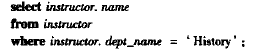
#### 1.5.3 数据定义语言(DDL)


### 1.6 数据库设计

数据库设计的主要内容是数据库模式的设计
#### 1.6.1 设计过程
1. 制定出用户需求的规格文档
2. 概念设计阶段，将需求转换为数据库的概念模式
3. 逻辑设计阶段
4. 物理设计阶段
#### 1.6.3 实体-联系模型(E-R模型)
实体通过**属性**集合来描述

**联系**是几个实体之间的关联

**实体集、联系集**：同一类型所有 *实体 / 联系* 的集合
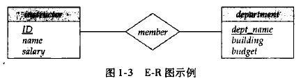

#### 1.6.4 规范化
目标：

​	1、没有不必要的冗余

​	2、能轻易地检索数据

使用**函数依赖**设计**范式**

### 1.7 数据存储和查询
数据库系统的功能部件可分为 *存储管理器* 和 *查询处理部件*
#### 1.7.1 存储管理器
存储管理部件包括：
- 权限及完整性管理器
- 事务管理器
- 文件管理器
- 缓冲区管理器

数据结构：
- 数据文件：存储数据库本身
- 数据字典：存储关于数据库结构的元数据（数据库模式）
- 索引：提供对数据项的快速访问

#### 1.7.2 查询处理器
查询处理器组件包括：
- DDL解释器：解释DDL语句并将定义记录在数据字典中
- DML编译器：将查询语言翻译为一个执行方案
- 查询执行引擎：执行由DML编译器产生的低级指令

### 1.8 事务
**事务**是数据库应用中完成单一逻辑功能的操作集合

其具有*原子性*、*一致性*、*持久性*

**恢复管理器**保证数据库系统的原子性和持久性

**并发控制管理器**控制并发事务间的相互影响，保证数据库的一致性

**事务管理器**包括并发控制管理器和恢复管理器

### 1.12 数据库用户和管理员
#### 1.12.1 数据库用户
数据库系统的用户可以分为四种不同类型：
- 无经验的用户
- 应用程序员
- 老练的用户
- 专门的用户
#### 1.12.2 数据库管理员
数据库管理员(DataBase Administrator, DBA)的作用包括：
- 模式定义
- 存储结构及存取方法定义
- 模式及物理组织的修改
- 数据访问授权
- 日常维护

### 1.14 总结
见书本P18


## 第二章 关系模型介绍

### 2.1 关系数据库的结构
关系数据库由**表**的结合构成

**关系** 用来指代表，**元组** 用来指代行，**属性** 用来指代表中的列


**关系实例**表示一个关系的特定的实例，即所包含的一组特定的行

**域**：关系中的属性允许取值的集合

若域中元素被看作是不可再分的单元，则域是**原子的**

**空值(null)**：一个特殊的值，表示值未知或不存在

### 2.2 数据库模式

**数据库模式**是数据库的逻辑设计

**数据库实例**是特定时刻数据库中数据的一个快照

**关系模式**对应与程序设计中的类型定义


department关系的模式：

### 2.3 码

**超码**：一个或多个属性的集合，可以使我们在一个关系中唯一地标识一个元组

**候选码**：最小的超码

**主码**：被设计者选中用来在一个关系中区分不同元组的***候选码***

r$_1$在属性中包括r$_2$的主码，这个属性在r$_1$上被称作参照r$_2$的**外码**

关系r$_1$称为外码依赖的**参照关系**，关系r$_2$称作外码的**被参照关系**

**参照完整性约束**：要求参照关系的元组在特定属性上的取值等于被参照关系中某个元组在该属性上的取值

### 2.4 模式图 


### 2.5 关系查询语言

**查询语言**：请求获取数据库信息的语言 <span id="2.5"></span>

*过程化语言、非过程化语言* [见1.4.1](#1.4.1) 

### 2.6 关系运算

**自然连接**：两个关系上所匹配的元组在两个关系共有的所有属性上取值*相同*

*笛卡尔积* 运算从两个关系中合并元组，结果包含两个关系元组的*所有对*，不论属性值是否匹配

第6章将详细介绍关系代数，因此此处不再概述

### 2.7 总结

见P28


## 第三章 初级SQL

### 3.1 SQL查询语言概览

SQL语言有以下几个部分：

- 数据定义语言(DDL)：定义关系模式、删除关系、修改关系模式
- 数据操纵语言(DML)：从数据库中查询信息、在数据库中插入元组、删除元组、修改元组
- 完整性：完整性约束
- 视图定义
- 事务控制
- 嵌入式SQL和动态SQL
- 授权： DDL可以定义对关系和视图的访问权限

### 3.2 SQL数据定义

#### 3.2.2 基本模式定义

**create table**命令的通用形式：


**create table**命令的例子：


三个基本的完整性约束：

- primary key$(A_1,A_2, \cdots )$：属性 $(A_1,A_2, \cdots )$ 构成关系的主码
- foreign key$(B_1,B_2, \cdots )$ references s：属性 $(B_1,B_2, \cdots )$ 上的取值必须对应于关系s中某元组在主码属性上的取值
- not null：该属性上不允许空值

### 3.3 SQL查询的基本结构

**自然连接**运算作用于两个关系，并产生一个关系作为结果。自然连接只考虑哪些在两个关系模式中都出现的属性上取值相同的元组对。

```mysql
select name,course_id
from instructor natural join teachers;
```

### 3.4 附加的基本运算

#### 3.4.1 更名运算

```mysql
select distinct T.name
from instructor as T, instrctor as S
where T.salary > S. salary and S.dept_name = 'Biology';
```

这种用**as**实现的重命名，被称作**表别名**或者是**相关名称**

#### 3.4.2 字符串运算

```mysql
select dept_name
from department
where building like '% Watson%'; 
-- 找出任意所在建筑名称中包含子串'Watson'的所有系名
```

字符串使用**like**操作符来实现模式匹配。用两个特殊字符来描述模式：

- **百分号(%)**：匹配任意字串
- **下划线(_)**：匹配任意一个字符

### 3.5 集合运算

**union, intersect, except**运算分别对应于集合论中的$\cup$(并) $\cap$(交), $-$(差)运算


### 3.6 空值

空值给关系运算带来了特殊的问题，包括算数运算、比较运算和集合运算

- 算术运算

  如果算数表达式任一输入为空，则该算数表达式结果为空

- 比较运算

  1 < null = unknown

- 布尔运算

  | 运算符  | true R unknown | false R unknown | unknown R unknown |
  | ------- | -------------- | --------------- | ----------------- |
  | **and** | unknown        | false           | unknown           |
  | **or**  | true           | unknown         | unknown           |

  **not unknown** = unknown

### 3.7 聚集函数

**聚集函数**是以值的一个集合为输入、返回单个值的函数

常见聚集函数：avg, min, max, sum, count

#### 3.7.2 分组聚集

```mysql
select dept_name, avg(salary) as avg_salary
from instructor
group by dept_name;
-- 找出每个系的平均工资
```

查询结果：

出现在**select**语句中但没有被聚集的属性只能是出现在**group by**子句中的那些属性

#### 3.7.3 having子句

**having**子句中的谓词在形成分组后才起作用
```mysql
select dept_name, avg(salary) as avg_salary
from instructor
group by dept_name
having avg(salary) > 42000
-- 找出每个平均工资大于42000的系
```

### 3.8 嵌套子查询

子查询是嵌套在另一个查询中的**select-from-where**表达式。

#### 3.8.1 集合成员资格

连接词**in/not in**测试元组是否是集合中的成员


#### 3.8.2 集合的比较

集合的比较需要用到比较运算符以及**some/all**关键词

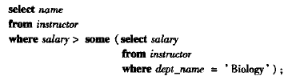

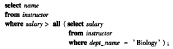

#### 3.8.3 空关系测试

**exists**结构在作为参数的子查询非空时返回**true**值


#### 3.8.5 from子句中的子查询

任何**select-from-where**表达式返回的结果都是关系，因而可以被插入到另一个**select-from-where**中任何关系可以出现的位置


#### 3.8.6 with子句

**with**子句提供定义临时关系的方法，这个定义只对包含**with**子句的查询有效


### 3.9 数据库的修改

#### 3.9.1 删除

```mysql
delete from r
where P;
```

#### 3.9.2 插入

```mysql
insert into course
values('CS-437','C++','CS',4)
```

#### 3.9.3 更新

```mysql
update instructor
set salary = salary * 1.05;
```

### 3.10 总结

见P57


## 第四章 中级SQL

### 4.1 连接表达式

#### 4.1.2 外连接

外连接的三种形式：

1. **左外连接(left outer join)**：只保留出现在左边的关系中的元组
2. **右外连接(right outer join)**：只保留出现在右边的关系中的元组
3. **全外连接(full outer join)**：保留出现在两个关系中的元组


**on**和**where**在外连接中的表现是不同的，**on**条件是外连接声明的一部分，但**where**子句却不是

### 4.2 视图

**视图**：不是逻辑模型的一部分，但作为虚拟关系对用户可见

#### 4.2.1 视图定义

**create view**命令的格式为：

```mysql
create view v as <query expression>;
-- <query expression> 可以是任何合法的查询表达式，v表示视图名
```

#### 4.2.2 SQL查询中使用视图

在查询中，视图名可以出现在关系名可以出现的任何地方。


#### 4.2.3 物化视图

**物化视图**：如果用于定义视图的实际关系改变，视图也跟着修改

保持物化视图一直在最新状态的过程称为*物化视图维护* 或 *视图维护*

#### 4.2.4 视图更新

一个视图是**可更新的**，如果其满足以下条件：

- from子句中只有一个数据库关系
- select子句只包含关系的属性名，不包含表达式、聚集或distinct声明
- 任何没有出现在select子句中的属性都没有not null约束，同时也不是主码的一部分
- 查询中不含有group by或having子句


### 4.3 事务

**事务**由查询和更新语句的序列组成

事务结束标志：

- **Commit work**：提交当前事务
- **Rollback work**：回滚当前事务

### 4.4 完整性约束

#### 4.4.2 not null 约束

**not null**声明禁止在该属性上插入空值

#### 4.4.3 unique 约束

`unique(A1,A2, ... ,Am)`

unique声明指出属性A1,A2,…Am形成了一个候选码

#### 4.4.4 check 子句

**check(P)**子句指定一个谓词P，关系中的每个元组都必须满足谓词P

```mysql
create table department
(dept_name varchar (20),
budget int,
check (budget>0));
```

#### 4.4.5 参照完整性

**参照完整性**：保证在一个关系中给定属性集上的取值也在另一关系的特定属性集的取值中出现

#### 4.4.7 断言

一个**断言**就是一个谓词，它表达了我们希望数据库总能满足的一个条件

断言为如下形式：`create assertion <assertion-name> check <predicate>;`

### 4.5 SQL的数据类型与模式

#### 4.5.2 默认值

SQL允许为属性指定默认值


#### 4.5.3 创建索引

**索引**：创建在关系的属性上，允许数据库高效地找到关系中那些在属性上取给定值的元组，而不用扫描关系中的所有元组

创建索引示例：`create index studentID_index on student(ID);`

### 4.6 授权

对数据的授权包括：

- 授权读取数据
- 授权插入新数据
- 授权更新数据
- 授权删除数据

每种类型的授权都称为一个**权限**

SQL包括select, insert, update, delete权限

grant语句用来授予权限，revoke语句用来收回权限

### 4.7 总结

见P85


## 第五章 高级SQL

### 5.3 触发器

**触发器**是一条语句，当对数据库做修改时，它自动被系统执行

设置触发器机制的要求：

- 指明什么条件下执行触发器
  - 一个引起触发器被检测的事件
  - 一个触发器执行必须满足的条件
- 指明触发器执行的动作


## 第六章 形式化关系查询语言

### 6.1 关系代数

关系代数是一种*过程化* 查询语言

关系代数的基本运算有：*选择、投影、并、集合差、笛卡尔积、更名*

其它运算：*集合交、自然连接、赋值*

#### 6.1.1 基本运算

一元运算：*选择、投影、更名*

二元运算：*并、集合差、笛卡尔积*

##### 6.1.1.1 选择运算

**选择($\sigma$)**运算选出满足给定谓词的元组

通常，我们允许在选择谓词中进行比较，使用的是：$=, \neq, <, \leq, >, \geq$

另外可以用连词$and(\and), or(\or), not(\neg)$将多个谓词合并为一个较大的谓词


##### 6.1.1.2 投影运算

**投影($\Pi$)**运算返回作为参数的关系


##### 6.1.1.3 关系运算的组合

由于关系代数运算的结果类型仍为关系，因此可以把多个关系代数运算组合成一个**关系代数表达式**


##### 6.1.1.4 并运算


要使**并**运算**$r \cup s$**有意义（*相容*），必须满足以下两个条件：

1. 关系r和s必须是同元的，即它们的属性数目必须相同
2. 对所有的i，r的第i个属性的域必须和s的第i个属性的域相同

##### 6.1.1.5 集合差运算

用$-$表示**集合差**运算表示在一个关系中而不在另一个关系中的那些元组


集合差运算必须在*相容*的关系间进行（与并运算类似），即关系同元且属性的域相同

##### 6.1.1.6 笛卡尔积运算

**笛卡尔积($\times$)**运算可以将任意两个关系的信息组合在一起


##### 6.1.1.7 更名运算

**更名($\rho$)**运算可以给关系赋予名字


#### 6.1.3 附加的关系代数运算

##### 6.1.3.1 集合交运算

**集合交($\cap$)**运算：$r  \cap s = r - ( r - s )$


##### 6.1.3.2 自然连接运算

r和s的**自然连接**表示为$r \Join s$


##### 6.1.3.3 赋值运算

**赋值($\leftarrow$)**运算可以给临时关系变量赋值

$r \Join s​$可以表示为：

##### 6.1.3.4 外连接运算

**外连接**运算是连接运算的扩展，它在结果中创建带空值的元组，以此来保留在连接中丢失的那些元组

外连接运算有三种形式：

- 左外连接：$=\Join \leftouterjoin$ 

  取出左侧关系中所有与右侧关系的任一元组都不匹配的元组，用空值填充所有来自右侧关系的属性

- 右外连接：$\Join=\rightouterjoin $

  与左外连接相反

- 全外连接：$= \Join = \fullouterjoin$

  既做左外连接也做右外连接


#### 6.1.4 扩展的关系代数运算

##### 6.1.4.1 广义投影

**广义投影**允许在投影列表中使用算数运算和字符串函数来对投影进行扩展

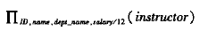

##### 6.1.4.2 聚集

**聚集函数**：输入值的一个汇集，将单一值作为返回值


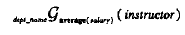

**聚集运算$\mathscr{G}$**(花体g)通常的形式：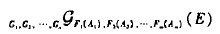


### 6.2 元组关系演算

代数表达式产生过程序列，而*元组关系演算* 是**非过程化**的

查询表达式为：$\{ t|P(t) \}$

#### 6.2.1 查询示例


#### 6.2.2 形式化定义

如果元组变量不被$\exist$或$\forall$修饰，这称为*自由变量*，否则称为*受限变量*


元组关系演算的公式由*原子* 构成，原子可以是一下形式之一：

- $s \in r$：s是元组变量，r是关系
- $s[x] \ \Theta\ u[y]$：其中s和u是元组变量，x和y是属性，$\Theta$是比较运算符（如：<）
- $s[x] \ \Theta \  c$：其中s是元组变量，x是属性，c是常量，$\Theta$是比较运算符

#### 6.2.3 表达式的安全性

P的**域dom(P)**是P所引用的所有值的集合


### 6.3 域关系演算

关系演算的另一种形式称为**域关系演算**，使用从属性域中取值的域变量，而不是整个元组的值

#### 6.3.1 形式化定义

域关系演算中的表达式形式：（$x_n$代表域变量）

域关系演算中的原子具有如下形式之一：


#### 6.3.2 查询的例子


### 6.4 总结

见P140


# 第二部分 数据库设计

## 第七章 数据库设计和E-R模型

### 7.1 设计过程概览

#### 7.1.1 设计阶段

- 完整刻画用户的数据需求
- 选择数据模型
- **概念设计阶段**
- 完善概念模式，指明功能需求（**功能需求规格说明**）
- **逻辑设计阶段、物理设计阶段**

#### 7.1.2 设计选择

*实体* 指示所有可以明确的个体

设计数据库模式时，必须避免两个主要缺陷：

- **冗余**：不好的设计可能会导致重复信息

  最大的问题是，当对一条消息进行更新时，这条消息的拷贝可能会与其不一致

- **不完整**：某些方面可能难以甚至无法建模

### 7.2 实体-联系模型

E-R数据模型采用三个基本概念：实体集、联系集、属性

#### 7.2.1 实体集

**实体**是现实世界中可区别于所有其他对象的一个“事物”或“对象”

**实体集**是相同类型具有相同性质（属性）的一个实体集合

实体通过一组**属性**来表示

每个实体的每个属性都有一个**值**

#### 7.2.2 联系集

**联系**是指多个实体间的相互关联

**联系集**是相同类型联系的集合

实体集$E_1, E_2, \cdots , E_n$**参与**联系集R

实体在联系中扮演的功能称为实体的**角色**

联系也可以具有**描述性属性**

参与联系集的实体集的数目称为联系集的**度**（二元联系集的度为2，三元联系集的度为3）

#### 7.2.3 属性

**域（值集）**：每个属性可取值的集合

属性类型：

- **简单**和**复合**属性：

  复合属性可以划分为更小的部分（其它属性）

  

- **单值**和**多值**属性：

  单值属性：一个属性只有单独的一个值

  多值属性：一个属性可能对应于一组值

- **派生属性**：

  这类属性的值可以从别的相关属性或实体派生出来

### 7.3 约束

#### 7.3.1 映射基数

**映射基数**：表示一个实体通过一个联系集能关联的实体的个数

+ 一对一
+ 一对多
+ 多对一
+ 多对多


#### 7.3.2 参与约束

如果实体集E中的每个实体都参与到联系集R的至少一个联系中，则称E在R中的参与是**全部**的

#### 7.3.3 码

一个实体的属性的值必须可以*唯一* 标识该物体

联系集的主码结构依赖于联系集的映射基数

### 7.5 实体-联系图

**E-R图**可以图形化标识数据库的全局逻辑结构

#### 7.5.1 基本结构


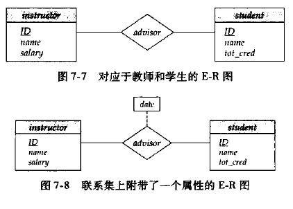

#### 7.5.2 映射基数


#### 7.5.3 复杂的属性

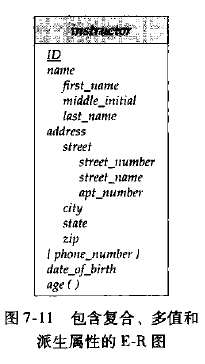

#### 7.5.6 弱实体集

**弱实体集**：没有足够的属性以形成主码的实体集

**强实体集**：有主码的实体集

弱实体集必须与另一个称作**标识**或**属主实体集**的实体集关联才能有意义

弱实体集**存在依赖**于标识实体集；标识实体集**拥有**它所标识的弱实体集

弱实体集与其标识实体集相连的联系称为**标识性联系**

弱实体集的**分辨符**可以区分其中的实体


#### 7.5.7 大学的E-R图

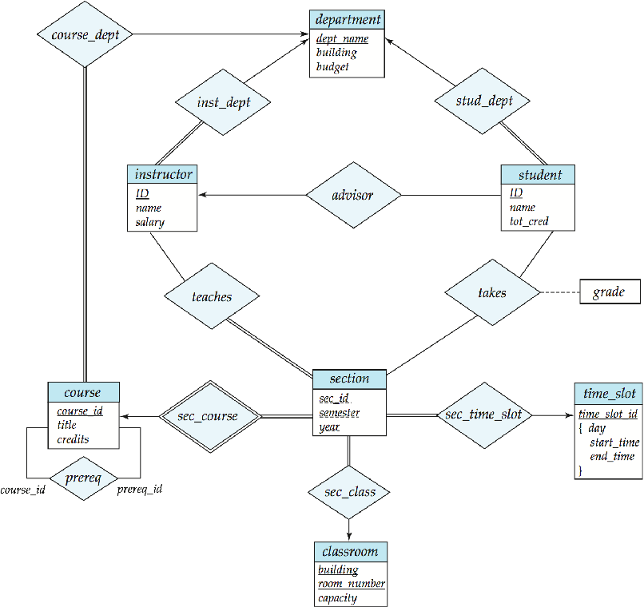

### 7.7 实体-联系设计问题

#### 7.7.1 用实体集还是用属性


常见错误：用一个实体集的主码作为另一个实体集的属性，而不是用联系

#### 7.7.2 用实体集还是用联系集

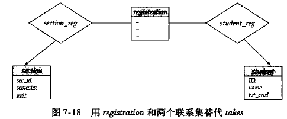

原则：当描述发生在实体间的行为时采用联系集

#### 7.7.3 二元还是n元联系集

数据库中的联系通常都是二元的，一些看来非二元的联系也可以用多个二元联系表示

#### 7.7.4 联系属性的布局

一对一或一对多联系集的属性可以放到一个参与该联系的实体集中，而不是放到实体集中


### 7.8 扩展的E-R特性

扩展E-R特性：特化、概化、高层和低层实体集属性继承、聚集

#### 7.8.1 特化

在实体集内部进行分组的过程称为**特化**（e.g. person->employee,student）

重叠特化：一个实体集可能属于多个特化实体集

不相交特化：一个实体集属于至多一个特化实体集


#### 7.8.2 概化

实体集间包含相同的属性可以通过**概化**来表达，概化是高层实体集与一个或多个实体集间的包含关系

高层与低层实体集也可以分别称作**超类**和**子类**

**概化**本质上是**特化**的逆过程

#### 7.8.3 属性继承

由特化和概化所产生的高层和低层实体的一个重要特性是**属性继承**

#### 7.8.4 概化上的约束

判定哪些实体能成为给定低层实体集的成员的条件：

- **条件定义的**：成员资格的确定基于实体是否满足一个显式的条件或谓词
- **用户定义的**：低层实体集由用户将实体指派给某个实体集

一个概化中一个实体是否可以属于多个低层实体集：

- **不相交**：一个实体至多属于一个低层实体集
- **重叠**：同一个实体可以同时属于多个低层实体集

对概化的**完全性约束**：

- **全部概化**或**特化**：每个高层实体必须属于一个低层实体集
- **部分概化**或**特化**：一些高层实体不属于任何低层实体集

#### 7.8.5 聚集

E-R模型的一个局限性在于它不能表达联系间的联系

**聚集**是一种抽象，通过这种抽象，联系被视为高层实体


### 7.11 总结

见P176


## 第八章 关系数据库设计

### 8.2 原子域和第一范式

一个域是**原子的**，如果该域的元素被认为是不可分的单元

关系模式R属于**第一范式（1NF），**如果R的所有属性的域都是原子的

### 8.3 使用函数依赖进行分解

属性集：$\alpha$

关系模式：r(R)

超码：K

一个关系模式是一个属性集，但是并非所有的属性集都是模式

#### 8.3.1 码和函数依赖

一个关系的满足所有这种现实世界约束的实例，称为关系的**合法实例**

R的子集K是r(R)的**超码**的条件：在关系r(R)的任一合法实例中，对于r的实例中的所有元组对$t_1$和$t_2$总满足，若$t_1 \neq t_2$，则$t_1[K] \neq t_2[K]$，

考虑一个关系模式r(R)，令$\alpha \subseteq R$ 且 $\beta \subseteq R$：

- 满足**函数依赖$\alpha \rightarrow \beta$**的条件是：对实例中所有元组对$t_1$和$t_2$，若$t_1[\alpha] = t_2[\alpha]$，则$t_1[\beta] = t_2[\beta]$ （单射）
- 如果在r(R)的每个合法实例中都满足函数依赖$\alpha \rightarrow \beta$，则函数依赖在模式r(R)上**成立**

两种方式使用函数依赖：

- 判定关系的实例是否满足给定函数依赖集F
- 说明合法关系集上的约束

有些函数依赖称为**平凡的**，因为它们在所有关系中都满足

如果$\beta \subseteq \alpha$，则形如$\alpha \rightarrow \beta$的函数依赖是**平凡的**

$F^+$符号表示F集合的**闭包**，表示F集合推导出的所有函数依赖的集合

#### 8.3.2 Boyce-Codd 范式（BCNF）

具有函数依赖集F的关系模式R属于BCNF的条件：

对$F^+$中所有形如$\alpha \rightarrow \beta$的函数依赖（其中$\alpha \subseteq R$且$\beta \subseteq  R$），下面至少有一项成立：

- $\alpha \rightarrow \beta$是平凡的函数依赖（即$\beta \subseteq \alpha$）
- $\alpha$是模式R的一个超码


一个数据库属于BCNF的条件是：构成该设计的关系模式集中的每个模式都属于BCNF

非BCNF模式转换为BCNF的分解：

- $(\alpha \cup \beta)$
- $(R - (\beta - \alpha))$

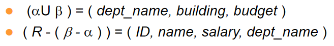

#### 8.3.4 第三范式

具有函数依赖集F的关系模式R属于**第三范式**的条件是：

对于$F^+$中所有形如$\alpha \rightarrow \beta$的函数依赖（其中$\alpha \subseteq R$且$\beta \subseteq R$），以下至少一项成立：

- $\alpha \rightarrow \beta$是一个平凡的函数依赖
- $\alpha$是R的一个超码
- **$\beta - \alpha$中的每个属性A都包含于R的一个候选码中（可以包含于*不同的* 候选码）**

### 8.4 函数依赖理论

#### 8.4.1 函数依赖集的闭包

如果关系模式r(R)的每一个满足F的实例也满足f，则R上的函数依赖f被r上的函数依赖集F**逻辑蕴涵**（$A\rightarrow B, B\rightarrow C$逻辑蕴涵$A\rightarrow C$）

F的**闭包**是被F逻辑蕴涵的所有函数依赖的集合，记作$F^+$

Armstrong公理：正确有效的，完备的

- **自反律**：若$\alpha$为一属性集且$\beta \subseteq \alpha$，则$\alpha \rightarrow \beta$成立

- **增补律**：若$\alpha \rightarrow \beta$成立且$\gamma$为一属性集，则$\gamma\alpha \rightarrow \gamma\beta$

- **传递律**：若$\alpha \rightarrow \beta$和$\beta \rightarrow \gamma$成立，则$\alpha \rightarrow \gamma$成立


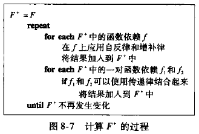

#### 8.4.2 属性集的闭包

如果$\alpha \rightarrow B$，我们称属性B被**$\alpha$属性确定**

令$\alpha$为一个属性集，F下被$\alpha$确定的所有属性的集合称为F下$\alpha$的就闭包，记为$\alpha^+$

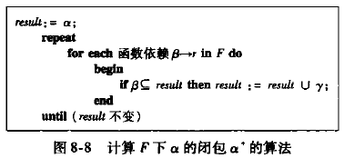

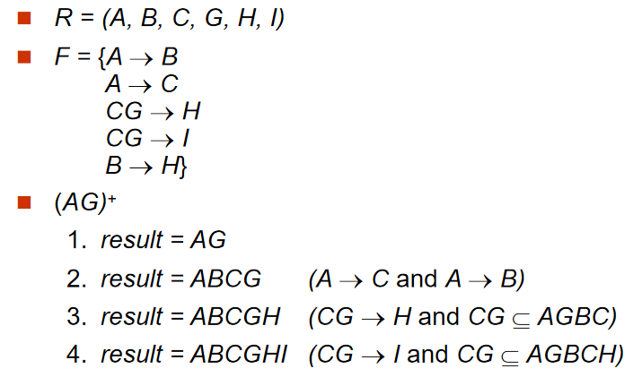

属性闭包算法有多种用途：

- 判断$\alpha$是否为超码：计算$\alpha^+$，检查$\alpha^+$是否包含R中的所有属性
- 检查函数依赖$\alpha \rightarrow \beta$是否成立：通过检查是否$\beta \subseteq \alpha^+$（是否属于$F^+$），即计算$\alpha^+$看是否包含$\beta$
- 计算$F^+$方法：对任意的$\gamma \subseteq R$，我们找出闭包$\gamma^+$；对任意的$S \subseteq \gamma^+$，我们输出一个函数依赖$\gamma \rightarrow S$

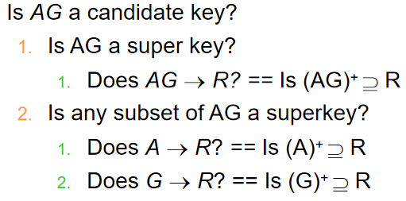

#### 8.4.3 正则覆盖

如果去除函数依赖中的一个属性不改变该函数依赖集的闭包，则称该属性是**无关的**

**无关属性**的形式化定义如下：考虑函数依赖集F及F中的函数依赖$\alpha \rightarrow \beta$


有效检验一个属性是否无关的方法，考虑$\alpha\rightarrow\beta$中的一个属性A：


example:

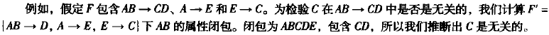

F的**正则覆盖**$F_c$是一个依赖集，使得F逻辑蕴含$F_c$中的所有依赖，并且$F_c$逻辑蕴含F中的所有依赖，且$F_c$必须具有如下性质：

- $F_c$中任何函数依赖都不含无关属性
- $F_c$中函数依赖的左半部分都是唯一的，即$F_c$中不存在两个依赖$\alpha_1\rightarrow\beta_1$和$\alpha_2\rightarrow\beta_2$，满足$\alpha_1=\alpha_2$

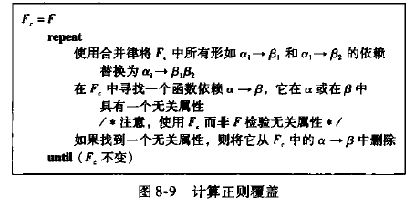

example:

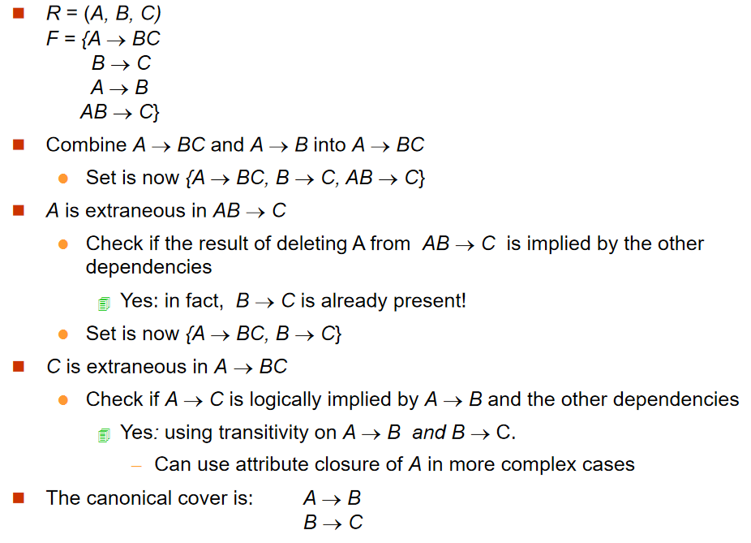

#### 8.4.4 无损分解

如果用两个关系模式$r_1(R_1)$和$r_2(R_2)$替代$r(R)$时没有信息损失，则我们称该分解是**无损分解**

不是无损分解的分解称为**有损分解**

$R_1$和$R_2$是R的无损分解，如果以下函数依赖中至少有一个属于$F^+​$:

- $R_1 \cap R_2 \rightarrow R_1$
- $R_1 \cap R_2 \rightarrow R_2$

example:


#### 8.4.5 保持依赖

F在$R_i$上的**限定**是$F^+$中所有只包含$R_i$中属性的函数依赖的集合$F_i$

令$F' = F_1 \cup F_2 \cup \cdots \cup F_n$，若分解具有性质$F'^+ = F^+$，则该分解被称为**保持依赖的分解**

验证方法一：

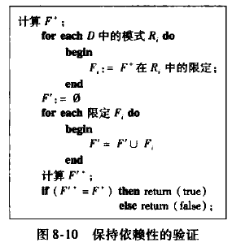

验证方法二：

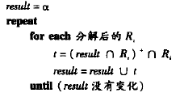


### 8.5 分解算法

#### 8.5.1 BCNF分解

##### 8.5.1.1 BCNF的判定方法

方法一：（对某些存在F中不存在而$F^+$中的函数依赖情况不适用）


方法二：

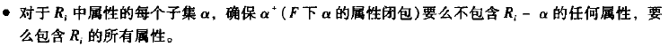

即，如果存在这样的函数依赖在$F^+$中，说明$R_i$违反BCNF

##### 8.5.1.2 BCNF分解算法

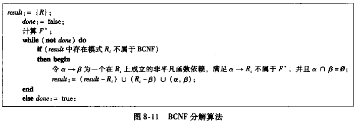

example:

模式：

class (course_id, title, dept_name, credits, sec_id, semester, year, building, room_number, capacity, time_slot_id)

函数依赖：

course_id→ title, dept_name, credits
building, room_number→capacity
course_id, sec_id, semester, year→building, room_number, time_slot_id

分解结果：

course(course_id, title, dept_name, credits)

classroom (building, room_number, capacity)

section (course_id, sec_id, semester, year, building, room_number, time_slot_id)

这三个关系模式都属于BCNF

#### 8.5.2 3NF分解


example:

关系模式：

cust_banker_branch (customer_id, employee_id, branch_name, type )

函数依赖：

customer_id, employee_id → branch_name, type
employee_id →branch_name
customer_id, branch_name → employee_id

正则覆盖：

customer_id, employee_id → type
employee_id →branch_name
customer_id, branch_name → employee_id

分解结果

(customer_id, employee_id, type)
(customer_id, branch_name, employee_id)

#### 8.5.3 3NF算法的正确性

（好像不重要，不管了）

#### 8.5.4 BCNF和3NF的比较

3NF的优缺点：

​	优点：总可以在满足无损并保持依赖的前提下得到3NF设计

​	缺点：可能不得不用空值表示数据项间的某些可能有意义的联系

数据库设计目标：

1. BCNF
2. 无损
3. 保持依赖

### 8.6 使用多值依赖的分解

令r(R)为一关系模式，并令$\alpha \subseteq R$且$\beta \subseteq R$，**多值依赖**$\alpha \rightarrow\rightarrow\beta$在R上成立的条件是，在关系r(R)的任意合法实例中，对于r中任意一对满足$t_1[\alpha]=t_2[\alpha]$的元组对$t_1$和$t_2$，r中都存在元组$t_3$和$t_4$，使得


$\alpha \rightarrow\rightarrow\beta$的表格表示：

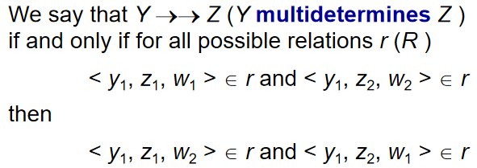

由多值依赖的定义，我们可以得出以下规则，对于$\alpha,\beta\subseteq R$：


### 8.8 数据库设计过程


### 8.10 总结

见 P206


# 第三部分 数据存储和查询

## 第十章 存储和文件结构

### 10.1 物理存储介质概述

- 高速缓冲存储器 （cache）
- 主存储器 (main memory)
- 快闪存储器 (flash memory)
- 磁盘存储器 （磁盘）
- 光学存储器 （光盘）
- 磁带存储器


### 10.2 磁盘和快闪存储器

#### 10.2.2 磁盘性能的度量

- 访问时间：发出读写请求到数据开始传输之间的时间
  - 寻道时间：磁盘臂重定位的时间
- 旋转等待时间：等待访问的扇区出现在读写头下所花费的时间
- 数据传输率：磁盘获取数据或者向磁盘存储数据的速率
- 平均故障时间：磁盘可靠性的度量标准

#### 10.2.3 磁盘块访问的优化

一个**块**是一个逻辑单元，它包含固定数目的连续扇区

### 10.3 RAID

为提高性能和可靠性，**独立磁盘冗余阵列(RAID)**技术被引入

#### 10.3.1 通过冗余提高可靠性

引入**冗余**可以提高可靠性，即存储正常情况下不需要的额外信息

**镜像**：复制每一张磁盘，这样一张逻辑磁盘由两张物理磁盘组成

#### 10.3.2 通过并行提高性能

通过在多张磁盘上进行**数据拆分**来提高传输速率

有比特级拆分和块级拆分等方式

#### 10.3.3 RAID级别

- RAID0 块级拆分但没有任何冗余
- RAID1 块级拆分的磁盘镜像
- RAID5 块交叉的分布奇偶校验位的组织结构

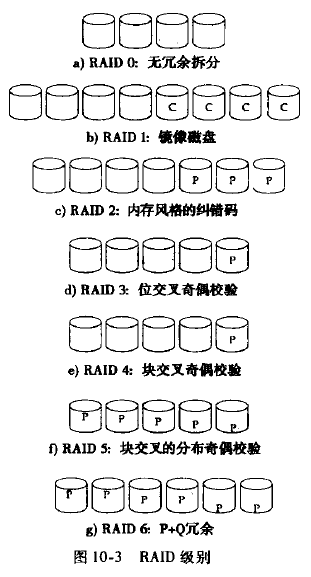

### 10.5 文件组织

一个**文件**在逻辑上组织成为记录的一个序列

每个文件分成定长的存储单元，称为**块**

#### 10.5.1 定长记录

在文件开始处，分配一定数量的字节作为**文件头**，包含有关文件的各种信息

被删除的记录形成链表，被称为**空闲链表**


#### 10.5.2 变长记录

变长记录有两个部分：初始部分是定长属性，后面是变长属性

对于定长属性，存储它们的值所需的字节数

对于变长属性，在记录的初始部分中表示为一个对（偏移量，长度）值

**空位图**：用来表示记录的哪个属性是空值


**分槽的页结构**，一般用于在块中组织记录，包含以下信息：

- 块头中记录条目的个数
- 块中空闲空间的末尾处
- 一个由包含记录位置和大小的记录条目组成的数组


实际记录从块的尾部开始*连续* 排列，块中的空闲空间是连续的


### 10.6 文件中记录的组织

- 堆文件组织：一条记录可以放在文件中的任何地方
- 顺序文件组织：记录根据“搜索码”的值顺序存储
- 散列文件组织：散列函数的结果去定了记录应该放到文件的哪个块中

#### 10.6.1 顺序文件组织

**顺序文件**按某个搜索码的顺序排序

**搜索码**是任何一个属性或者属性的集合

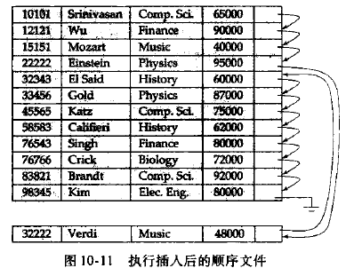

#### 10.6.2 多表聚簇文件组织

**多表聚簇文件组织**是一种在每一块中存储两个或者更多个关系的相关记录的文件结构


### 10.7 数据字典存储

**元数据**：关于数据的数据（如关系的模式）

元数据存储在称为**数据字典**或**系统目录**中的结构中

系统必须存储的信息类型有：


### 10.9 总结

见P264


## 第十一章 索引与散列

### 11.1 基本概念

两种基本索引类型：

- **顺序索引**：基于值的顺序排序
- **散列索引**：基于将值平均分布到若干散列桶中，一个值所属的散列桶是由一个函数决定的，这个函数称为*散列函数*

对每种技术的评价基于以下因素：


用于在文件中查找记录的属性或属性集称为**搜索码**

### 11.2 顺序索引

如果文件按照某个搜索码指定的顺序排序，那么该搜索码对应的索引称为**聚集索引**，也称为**主索引**

搜索码制定的顺序与文件中记录的物理顺序不同的索引称为**非聚集索引**或**辅助索引**

**索引顺序文件**：搜索码上有聚集索引的文件

example:


#### 11.2.1 稠密索引和稀疏索引

**索引项**或**索引记录**由一个搜索码值和指向具有该搜索码的一条或多条记录的指针构成

- **稠密索引**：在稠密索引中，文件中的每个搜索码值都有一个索引项

  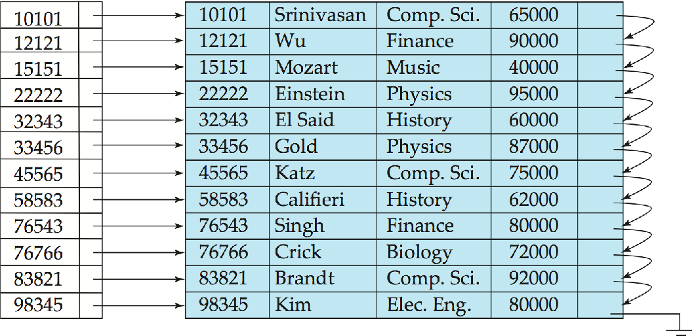

- **稀疏索引**：在稀疏索引中，只为搜索码的某些值建立索引项

  

#### 11.2.2 多级索引

具有两级或两级以上的索引称为**多级**索引


#### 11.2.3 索引的更新

每当文件有记录更新时，索引都需要更新

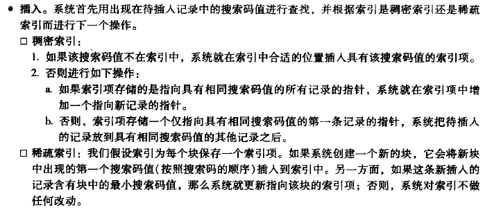


#### 11.2.4 辅助索引

辅助索引必须是稠密索引，对每个搜索码值都有一个索引项


#### 11.2.5 多码上的索引

一个包含多个属性的搜索码被称为**符合搜索码**

### 11.5 多码访问

#### 11.5.1 使用多个单码索引

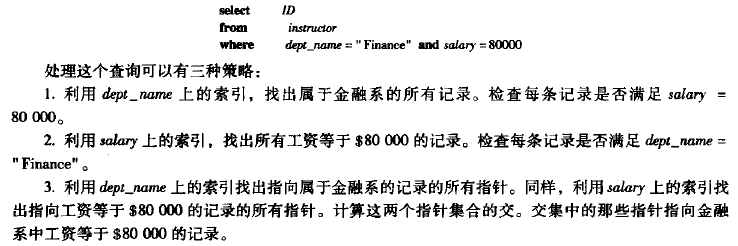

#### 11.5.2 多码索引

在复合的搜索码上建立和使用索引

#### 11.5.3 覆盖索引

**覆盖索引**存储一些属性（但不是搜索码属性）的值以及指向记录的指针

### 11.6 静态散列

基于散列技术的文件组织使我们能够避免访问索引结构

**桶**：表示能存储一条或多条记录的一个存储单位

**散列文件组织**中，我们通过计算所需记录搜索码值上的一个函数直接获得包含该记录磁盘快地址

**散列索引组织**中，我们把搜索码以及与它们相关联的指针组织成一个散列文件结构

#### 11.6.1 散列函数

我们希望搜索码值分配到桶中并且具有以下分布特性的散列函数：分布是*均匀的*、*随机的*

#### 11.6.2 桶溢出处理

如果桶没有足够的空间，就会发生**桶溢出**，有以下几个可能原因：

- **桶不足**

- **偏斜** （某些桶分配到的记录比其它的桶多）

  偏斜发生的原因：

  - 多条记录可能具有相同的搜索码
  - 所选的散列函数可能会造成搜索码的分布不均

我们用**溢出桶**来处理溢出问题，这种链接列表的溢出处理称为**溢出链**

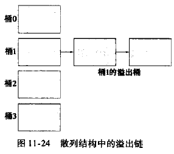

上面这种形式的散列结构称为**闭地址**，下面这种方法称为**开地址**

桶集合是固定的，没有溢出链

当一个桶满了以后，系统将记录插入到其它桶中

该方法在数据库系统不使用，因为删除操作太麻烦

#### 11.6.3 散列索引

**散列索引**将搜索码及其相应的指针组织成散列文件结构

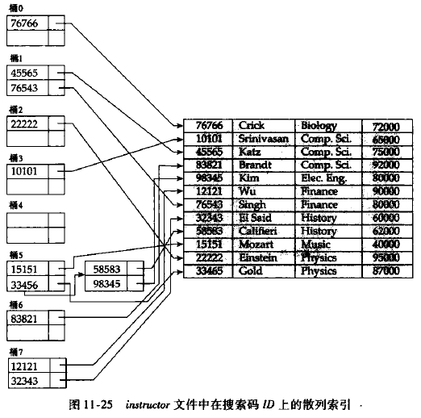

### 11.7 动态散列

**动态散列**技术允许散列函数动态改变，以适应数据库增大或缩小的需要

#### 11.7.1 数据结构

选择一个具有均匀性和随机性的散列函数h，h可以产生值的范围较大，是b位二进制整数

开始时我们不使用b位，而是使用i位，i会随着文件增长而变化

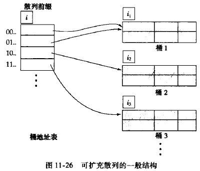

#### 11.7.2 查询和更新

假定要插入一条搜索码值为K的记录，最终定位到某个桶j

算法：

若桶j中有剩余空间，直接将记录插入

若桶j已经满，则分裂桶并重新分配记录

​	若$i > i_j$（前缀位数），那么在桶地址表中有多个表项指向桶j，直接分裂桶j，将i值设置为$i_j+1$即可

​	若$i = i_j$，那么在桶地址表中只有一个表项指向桶j，增加桶地址表的大小，以容纳由于桶j分裂而产生的两个桶指针，$i = i+1$，分裂出来的桶i值设置为i+1，将原来桶中的记录重新分配

​		若分裂多次还不能成功（如搜索码值都是相同的情况），则采用溢出桶来记录

example:

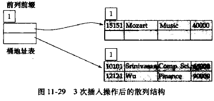

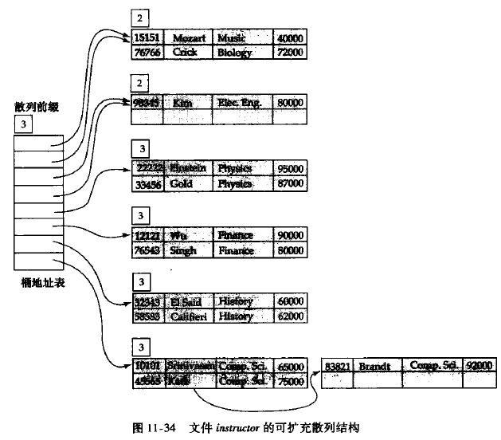

#### 11.7.3 静态散列与动态散列比较

可扩充散列

- 优点：

  性能不随文件的增长而降低

  空间开销是最小的，尽管桶地址表带来了额外的开销，但该表较小

- 缺点：

  查找涉及一个附加的间接层，对性能有微小的影响


### 11.8 顺序索引和散列的比较

普通查询散列更有优势

范围查询顺序索引更可取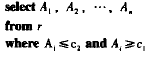

### 11.9 位图索引

位图索引是一种为多码上的简单查询设计的特殊索引，尽管每个位图索引都是建立在一个码之上的

#### 11.9.1 位图索引结构

**位图**就是位的一个简单数组

关系r的属性A上的**位图索引**是由A能取的每个值建立的位图构成的

example: 

​	gender: mffmf	income_level: 12143

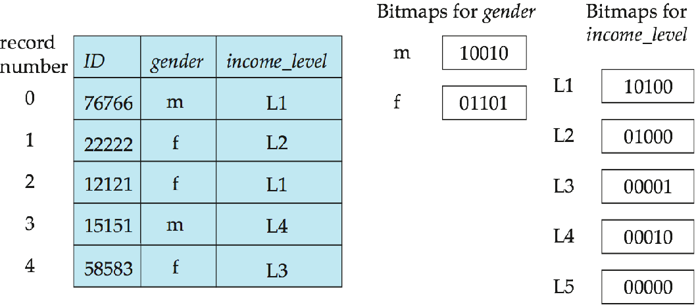

查询 where gender = ‘f’ and income_level = ‘L2’

我们执行两个位图的**交**操作，得到位图01000

统计满足条件的元组数时，甚至可以在不需要访问关系的条件下就可以从位图索引中得到需要的结构

### 11.11 总结

见P300


## 第十二章 查询处理

**查询处理**：从数据库中提取数据时涉及的一系列活动

### 12.1 概述

查询处理步骤如图所示，基本步骤包括：语法分析与翻译、优化、执行


查询处理开始之前，系统必须将查询语句翻译成可使用的形式

给定一个查询，一般会有多种计算结果的方法

example:

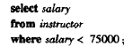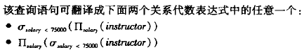

**计算原语**：加了“如何执行”注释的关系代数运算

**查询执行计划**：执行一个查询的愿与操作序列

**查询执行引擎**：接受一个查询执行计划，执行该计划并把结果返回给查询


### 12.2 查询代价的度量

在数据库系统中，最主要的代价是在磁盘上存取数据的代价

*传送磁盘块数* 以及*搜索磁盘次数* 被用来度量查询计算机化的代价

- 传输一个块的数据平均消耗$t_T$秒
- 磁盘块平均访问时间$t_S$秒

显然一次传输b块且执行S次磁盘搜索将消耗$b*t_T+S*t_S$秒

一个查询计算计划**响应时间**就是所有的这些开销，并且可以作为计划的代价的度量

### 12.3 选择运算

在查询处理中，**文件扫描**是存取数据最低级的操作

#### 12.3.1 使用文件扫描和索引的选择

- **A1（线性搜索）**：系统扫描每一个文件块，对所有记录都进行测试

使用索引的搜索算法称为**索引扫描**

- **A2（主索引，码属性等值比较）**：使用索引检索到满足相应等值条件的唯一一条记录

- **A3（主索引，非码属性等值比较）**：利用主索引检索到多条记录，与A2相比需要取多条记录

- **A4（辅助索引，等值比较）**：

  若等值条件是码属性上的，则该策略可检索到唯一一条记录

  ​	这种情况下代价与A2相似

  若索引字段是非码属性的，则可能检索到多条记录

  ​	这种情况下每检索一条记录都需要一次I/O操作（搜索+磁盘块传输）

- （A5, A6不重要不管）

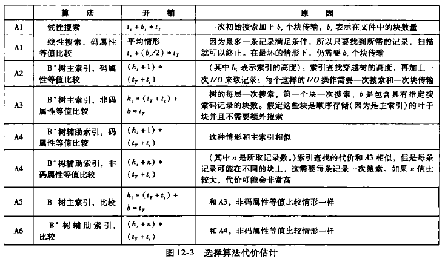

### 12.4 排序

数据排序有重要作用，有两个原因：

1. SQL查询会指明对结果进行排序
2. 当输入的关系已经排序时，关系运算中的一些运算（如连接运算）能够得到高效实现

#### 12.4.1 外部排序归并算法

**外排序**：不能全部放在内存中的关系的排序

M表示内存缓冲区中可以用于排序的块数，即内存的缓冲区能容纳的磁盘块数

1. 第一阶段，建立多个排好序的**归并段**，每个归并段都是排序过的，但仅包含关系中的部分记录

   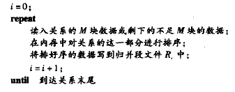

2. 第二阶段，对归并段进行*归并*。假定归并段总数N<M，为N个归并段文件Ri各分配一个内存缓冲块，并分别读入一个数据块；

   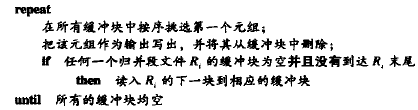

该算法对N个归并段进行归并，因此它被称为**N路归并**

一般而言，关系比内存大得多，即N>>M，因此归并要分多趟进行，每趟可以用M-1个归并段作为输入。这样每趟下来，归并段的数目都减少到原来的1/(M-1)，直至归并段数目小于M得到排序的输出结果

example: M=3（两块用于输入，一块用于输出）

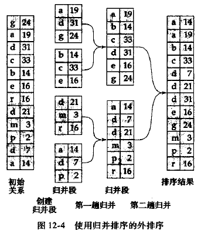

#### 12.4.2 外部排序归并的代价分析

$b_r$代表包含关系r中记录的磁盘块数

磁盘块传输：

第一阶段：

- 磁盘块传输：$2b_r$次

第二阶段：

- 归并趟数：$\lceil log_{M-1}(b_r/M)\rceil$
- 每一趟归并读写各一次
- 最后一趟归并可以只产生结果而不写入磁盘

磁盘块传输总数：$2b_r+b_r(2*\lceil log_{M-1}(b_r/M)\rceil-1)= b_r(2\lceil log_{M-1}(b_r/M)\rceil+1)$

磁盘搜索：

第一阶段：

- 读取写回归并段：$2\lceil b_r/M\rceil$

第二阶段：

- 每次从一个归并段读取$b_b$块数据，每趟归并需要作$\lceil b_r/b_b\rceil$次磁盘搜索以读取数据
- 假设输出阶段也分配了$b_b$个块，每一趟可以归并$\lfloor M/b_b\rfloor-1$个归并段

磁盘搜索总次数：$2\lceil b_r/M\rceil+\lceil b_r/b_b\rceil(2\lceil log_{\lfloor M/b_b\rfloor-1}(b_r/M)\rceil-1)$

（本质上就是第二阶段的M和$b_r$都除以$b_b$）

### 12.5 连接运算

**等值连接**：表示形如$r \Join_{r.A=s.B}s$的连接，其中A,B分别为r与s的属性或属性组

- student记录数：$n_{student}=5000$
- student磁盘块数：$b_{student}=100$
- takes记录数：$n_{takes}=10000$
- takes磁盘块数：$b_{takes}=400$

#### 12.5.1 嵌套循环连接

该算法主要由两个嵌套的for循环构成，因此被称为**嵌套循环连接**


对于$r \Join s$，r被称为连接的**外层关系**，s被称为连接的**内层关系**

- r,s中元组数：$n_r,n_s$
- 包含关系r,s中元组的磁盘块数：$b_r, b_s$
- 需要考虑的元组对数目：$n_r*n_s$
- 对关系r中的每一条记录，我们必须对s作一次完整的扫描

|              | 最坏情况      | 最好情况  |
| ------------ | ------------- | --------- |
| **块传输**   | $n_r*b_s+b_r$ | $b_r+b_s$ |
| **磁盘搜索** | $n_r + b_r$   | $2$       |

#### 12.5.2 块嵌套循环连接


**块嵌套循环连接**是嵌套循环连接的一个变种，内层关系的每一块与外层关系的每一块形成一对

|              | 最坏情况      | 最好情况  |
| ------------ | ------------- | --------- |
| **块传输**   | $b_r*b_s+b_r$ | $b_r+b_s$ |
| **磁盘搜索** | $2b_r$        | $2$       |


#### 12.5.3 索引嵌套循环连接

（不管了）

### 12.6 其他运算

#### 12.6.1 去除重复

用排序方法可以很容易地实现去除重复

#### 12.6.2 投影

对每个元组作投影，所得结果关系可能有重复记录，然后去除重复记录

### 12.7 表达式计算

#### 12.7.1 物化

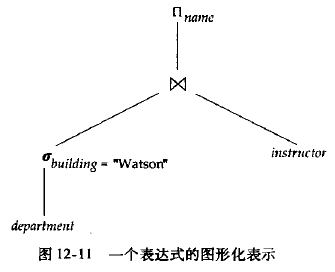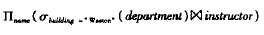

**运算符数**：对表达式做图形化表示

当采用物化方法时，从表达式的最底层的运算（在树的底部）开始

**物化计算**：运算的每个中间结果被创建（物化），然后用于下一层的运算

#### 12.7.2 流水线

**流水线计算**：将多个关系操作组合成一个操作的流水线来实现，其中一个操作的结果将传送到下一个操作

优势：

1. 消除读和写临时关系的代价，减少查询计算代价
2. 如果一个查询计算计划的根操作符及其输入合并到流水线中，那么可以迅速开始产生查询结果

##### 12.7.2.1 流水线的实现

1. *需求驱动的流水线* ，系统不停地向位于流水线顶端的操作发出需要元组的请求
2. *生产者驱动的流水线* ，各操作不等待元组请求，而是积极地产生元组

### 12.8 总结

见P325


## 第十三章 查询优化

**查询优化**：从给定查询的的多种可能策略中找出最有效的查询执行计划的一种处理过程

### 13.1 概述

example:

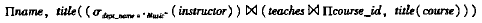


给定一个关系代数表达式，查询优化器的任务是产生一个查询执行计划，该计划能获得与原关系表达式相同的结果，并且得到结果集的执行代价最小

查询执行计划的产生步骤：

1. 产生逻辑上与给定表达式等价的表达式
2. 对所产生的表达式以不同方式作注释，产生不同的查询计划
3. 估计每个执行计划的代价，选择代价最小的一个

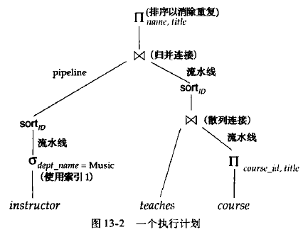

### 13.2 关系表达式的转换

如果两个关系表达式在每一个有效数据库实例中都会产生相同的元组集，则我们称它们是**等价的**

#### 13.2.1 等价规则

**等价规则**指出两种不同形式的表达式是等价的

1. 
2. 
3. 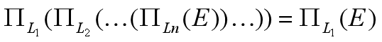
4. 
5. 
6. 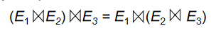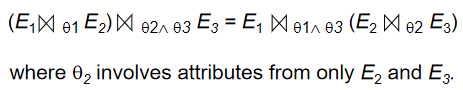

7. 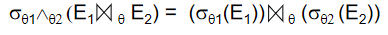
8. 
9. 
10. 
11. 
12. 


见P331-332

总的来说就是不同形式的交换律、结合律、分配律

#### 13.2.2 转换的例子


见P333

#### 13.2.3 连接的次序

一个好的连接运算次序对于减少临时结果的大小是很重要的

虽然这两个表达式等价，但是计算它们的代价可能不同

#### 13.2.4 等价表达式的枚举


### 13.3 表达式结果集统计大小的估计

#### 13.3.1 目录信息

- $n_r$：关系r的元组数
- $b_r$：包含关系r中元组的磁盘块数
- $l_r$：关系r中每个元组的字节数
- $f_r$：关系r的块引子——一个磁盘块能容纳关系r中元组的个数
- $V(A,r)$：关系r中属性A中出现的非重复值个数

显然有等式$b_r = \lceil {n_r/f_r}\rceil$

**等宽直方图**：取值范围分成相等大小的区间

**等深直方图**：每个区间的取值个数相同


#### 13.3.2 选择运算结果大小的估计

- $\sigma _{A=a}(r)$：$n_r/V(A,r)$个元组

- $\sigma _{A\leq a}(r)$：个元组

- 复杂选择：

  - 合取：

    关系中的一个元组满足条件选择$\theta_i$的概率为$s_i/n$，这概率被称为选择$\sigma_{\theta_i}(r)$的**中选率**

    合取的元组数量：

  - 析取：

    析取的元组数量：

  - 取反：$\sigma_{\lnot \theta}(r)$

    取反的元组数量：$n_r-\sigma_\theta(r)$

#### 13.3.3 连接运算结果大小的估计

对于$r \Join s$，令r(R)和s(S)为两个关系

- 若$R\cap S=\varnothing$，则两关系没有共同属性，此时$r\Join s=r\times s$
- 若$R\cap S$是R或S的码，则此时得到元组数与r或s中的元组数相同
- 若$R \cap S$既不是R也不是S的码，假定$R \cap S = \{A\}$，此时应该有$(n_r\times n_s)/V(A,s)$个元组

#### 13.3.4 其它运算的结果集大小的估计

- **投影**：估计为V(A,r)，因为投影去除了重复元组
- **聚集**：
- **集合运算**：可以重写为合取、析取以及取反进行计算
- **外连接**：

### 13.4 执行计划选择

**基于代价的优化器**从给定查询等价的所有查询执行计划空间中进行搜索，并选择估计代价最小的一个

#### 13.4.1 基于代价的连接顺序选择

考虑表达式$r_1\Join r_2\Join \dots \Join r_n$，当n=3时，有12种不同的连接顺序


对于


#### 13.4.3 启发式优化

查询优化器使用**启发式方法**来减少优化代价

对关系代数查询进行转换的例子：

- 尽早执行选择运算

- 尽早执行投影运算

  **左深连接顺序**用于流水线计算特别方便，因为右操作对象是一个已存储的关系，每个连接只有一个输入来自流水线

  

许多优化器允许为查询优化指定**优化成本预算**，当超过预算时停止搜索，返回当前找到的最优计划

### 13.7 总结

见P350

# 第四部分 事务管理

## 第十四章 事务

**事务**：构成单一逻辑操作单元的操作集合

数据库系统要么执行整个事务，要么属于该事务的操作一个也不执行

### 14.1 事务概念

**事务**是访问并可能更新各种数据项的一个程序执行**单元**

事务的性质（**ACID特性**）：

- **原子性(atomicity)**：事务的所有操作在数据库中要么全部正确反映出来，要么完全不反映
- **一致性(consistency)**：隔离执行事务时，保持数据库的一致性
- **隔离性(isolation)**：每个事务感觉不到系统中有其它事务在并发地执行
- **持久性(durability)**：一个事务成功完成后，对数据库的改变是永久的，即使出现系统故障

### 14.2 一个简单的事务模型

事务运用以下两个操作访问数据：

- **read(X)**：从数据库把数据库项X传送到执行**read**操作的事务的主存缓冲区的一个也称为X的变量中
- **write(X)**：从执行**write**的事务的主存缓冲区的变量X中把数据项X传回数据库中


### 14.3 存储结构

- 易失性存储器：其中的信息在系统崩溃后不会幸存
- 非易失性存储器：其中的信息在系统崩溃后幸存
- 稳定性存储器：其中的信息*永远* 不会丢失

### 14.4 事务原子性和持久性

**中止(aborted)**：事务没有成功地执行完成

**回滚(rolled back)**：中止事务造成的变更被撤销

**日志(log)**：负责管理事务中止

事务的状态：

- **活动的(active)**：初始状态，事务执行时处于这个状态
- **部分提交的(partially committed)**：最后一条语句执行后
- **失败的(failed)**：发现正常的执行不能继续后
- **中止的(aborted)**：事务回滚并且数据库已恢复到事务开始执行前的状态后
- **提交的(committed)**：成功完成后


如果事务是提交的或中止的，它称为**已经结束的(terminated)**

事务进入中止状态后，系统有两种选择：

- 重启(restart)事务：当引起事务中止的是硬件错误，或不是由事务的内部逻辑所产生的软件错误时
- 杀死(kill)事务：事务的内部逻辑造成错误

### 14.5 事务隔离性

事务并发的优点：

- 提高吞吐率和资源利用率
- 减少等待时间

**调度(schedule)**：指令在系统中执行的时间顺序

**串行的(serial)**：每个串行调度由来自各事务的指令序列组成，其中属于同一事务的指令在调度中紧挨在一起


**可串行化调度**：在并发执行中，通过保证所执行的任何调度的效果都与没有并发执行的调度效果一样，我们可以确保数据库的*一致性*。调度应该在某种意义上等价于一个串行调度。

### 14.6 可串行化

I与J的冲突：


只有都为I与J都为read的时候，执行顺序才是无关紧要的

**冲突等价**：如果调度S可以经过一系列非冲突指令交换成S'，则S与S'是**冲突等价**的


若一个调度S与一个串行调度冲突等价，则称调度S是**冲突可串行化**的

**优先图**：S是一个调度，由S构造一个有向图


**串行化顺序**可通过**拓扑排序**得到，拓扑排序用于计算与优先图的偏序相一致的线性顺序


### 14.7 事务隔离性和原子性

#### 14.7.1 可恢复调度

若Tj读取了Ti写入的值，则Tj**依赖**于Ti

**可恢复调度**：对于每对事务Ti和Tj，如果Tj读取了之前由Ti所写的数据项，则Ti先于Tj提交

*不可恢复* 调度例子：

#### 14.7.2 无级联调度

**级联回滚**：因单个事务故障导致一系列事务回滚

**无级联调度**：对于每对事务Ti和Tj，如果Tj读取了先前由Ti所写的数据项，则Ti必须在Tj这一操作前提交

### 14.8 事务隔离性级别

SQL标准规定的隔离性级别如下：

- 
- 
- 
- 

以上所有隔离性级别都不允许**脏写**，即一个数据项已经被另外一个尚未提交或中止的事务写入，则不允许对该数据项执行写操作

### 14.9 隔离性级别的实现

- 锁
- 时间戳
- 多版本和快照隔离

### 14.11 总结

见P370


## 第十五章 并发控制

### 15.1 基于锁的协议

确保隔离性的方法之一是要求对数据项以*互斥* 的方式进行访问

#### 15.1.1 锁

1. **共享型锁**：lock-S(Q)，事务Ti可读但不能写数据项Q
2. **排他型锁**：lock-X(Q)，事务Ti既可读也能写数据项Q

事务根据自己对Q的操作类型**申请**适当的锁，等到并发控制管理器**授予**所需锁才能继续操作

锁相容性矩阵：

|       | **S** | **X** |
| ----- | ----- | ----- |
| **S** | true  | false |
| **X** | false | false |

若数据项已被另一事务加上了不相容类型的锁，则Ti只好**等待**直到锁被释放

**死锁**：两个事务都不能正常执行的状态

死锁发生时，系统必须回滚两个事务中的一个，一旦某个事务回滚，该事务回滚的数据项就被解锁

**封锁协议**：规定事务何时对数据项们进行加锁、解锁

封锁协议**保证**冲突可串行性$\iff$所有合法的调度都是冲突可串行化的（关联的$\rightarrow$关系无环）

#### 15.1.2 锁的授予

**饿死**：事务Ti永远得不到进展，因为总是得不到锁

避免饿死的加锁方式：

1. 不存在在数据项Q上持有与M型锁冲突的锁的其它事务
2. 不存在等待对数据项Q加锁且先于Ti申请加锁的事务

此时一个加锁请求就不会被其后的加锁申请阻塞

#### 15.1.3 两阶段封锁协议

**两阶段封锁协议**要求每个事务分两个阶段提出加锁和解锁申请：

1. **增长阶段**：事务可以获得锁，但不能释放锁

2. **缩减阶段**：事务可以释放锁，但不能获得锁

**封锁点**：调度中事务获得最后加锁的位置（增长阶段结束点）

**严格两阶段封锁**可以避免级联回滚，要求所有排他锁必须在事务提交后才能释放

**强两阶段封锁**要求事务提交之前不得释放任何锁

任何形式的两阶段封锁协议只产生冲突可串行化的调度

锁转换：

- 升级：共享锁 $\rightarrow$ 排他锁
- 降级：排他锁 $\rightarrow$ 共享锁
- 锁的升级只能发生在增长阶段，锁的降级只能发生在缩减阶段


#### 15.1.4 封锁的实现

**锁管理器**可以实现为一个过程，它从事务接收消息并反馈消息

**锁表**：以数据项名称为索引的散列表来查找链表中的数据项


#### 15.1.5 基于图的协议

**数据库图**：数据项集合D满足偏序关系，故可以视为一个有向无环图


**树形协议**：可用的加锁指令只有lock-X，并且要遵循以下规则：


例子：

可以通过记录数据项最后被哪个事务修改而保证可恢复性

树形协议不产生死锁，因此不需要回滚

树形协议可以在较早时候释放锁，减少等待时间增加了并发性

缺点：事务可能必须为其不需要的数据项加锁

### 15.2 死锁处理

处理死锁问题的两种方法：

1. **死锁预防**：保证系统*永不* 进入死锁状态
2. 允许系统进入死锁状态，然后试着用**死锁检测**和**死锁恢复**机制进行恢复

#### 15.2.1 死锁预防

预防死锁的两种方法：

1. 对加锁请求进行排序或要求同时获得所有的锁来保证不会发生循环等待
2. 每当等待有可能导致死锁时，进行回滚而不是等待加锁

- 第一种方法：要么一次全部封锁，要么全不封锁

  缺点：

  - 很难预知哪些数据项要被使用 
  - 数据项使用率可能很低

  另一种机制：对数据项强加一个次序（树形协议偏序）

- 第二种方法：抢占与事务回滚

  通过回滚事务Ti来将抢占其持有的锁，并将其授予Tj

  通过**时间戳**来决定事务应当等待还是回滚

  两种机制：

  1. **wait-die**机制基于非抢占技术

     当Ti时间戳小于Tj时（Ti比Tj老），允许Ti等待，否则Ti回滚（死亡）

  2. **wound-wait**机制基于抢占技术

     当Ti时间戳大于Tj时（Ti比Tj年轻），允许Ti等待，否则Tj回滚（Tj被Ti伤害）

- 第三种方法：锁超时

  申请锁的事务至多等待一段给定的时间，若超时则回滚并重启

#### 15.2.2 死锁检测与恢复

为实现检测与恢复机制，系统必须：


##### 15.2.2.1 死锁检测

死锁可以用**等待图**来精确描述

​	当事务Ti申请的数据项当前被Tj持有时，边Ti$\rightarrow$Tj被插入等待图中

​	系统中存在死锁$\iff$等待图包含环


##### 15.2.2.2 从死锁中恢复

1. **选择牺牲者**

   决定回滚哪一个（哪一些）事务以打破死锁，使代价最小

2. **回滚**

   必须要决定事务要回滚多远（彻底回滚、部分回滚）

3. **饿死**

   保证一个事务被选为牺牲者的次数有限，避免总是被选为牺牲者


### 15.3 多粒度

允许系统定义多级**粒度**的机制，即通过各种大小的数据项定义数据粒度的层次结构

若事务Ti给Fb**显式**地加排他锁，则Ti也给所有属于该文件的记录**隐式**地加排他锁

**意向锁**：一个结点加上了意向锁，则意味着要在树的较低层进行显示加锁；在一个结点显式加锁之前，该结点的全部祖先结点均加上了意向锁

**共享型意向锁(IS)**：较低层进行显式封锁，但只能加共享锁

**排他型意向锁(IX)**：较低层进行显式封锁，可以加排他锁或共享锁

**共享排他型意向锁(SIX)**：以该结点为根的子树显式地加了共享锁，且树的更底层显式地加排他锁

|         | IS    | IX    | S     | SIX   | X     |
| ------- | ----- | ----- | ----- | ----- | ----- |
| **IS**  | true  | true  | true  | true  | false |
| **IX**  | true  | true  | false | false | false |
| **S**   | true  | false | true  | false | false |
| **SIX** | true  | false | false | false | false |
| **X**   | false | false | false | false | false |

**多粒度封锁协议**采用这些锁来保证可串行性

加锁按*自顶向下* 的顺序（根到叶），释放锁按*自底向上* 的顺序（叶到根）

该协议增加了并发性，减少了锁的开销

example:


### 15.4 基于时间戳的协议

#### 15.4.1 时间戳

对于系统中的每个事务Ti，把时间戳TS(Ti)与其联系起来

时间戳可以用**系统时钟**或**逻辑计数器**来表示

事务的时间决定了串行化顺序

**W-timestamp(Q)**执行**write(Q)**的所有事务的最大时间戳

**R-timestamp(Q)**执行**read(Q)**的所有事务的最大时间戳

每当有新的read(Q)和write(Q)指令执行时，这些时间戳就更新

#### 15.4.2 时间戳排序协议

**时间戳排序协议**保证任何有冲突的**read**或**write**操作按时间戳顺序执行


该协议保证无死锁，因为不存在等待的事务

#### 15.4.3 Thomas写规则

修改write(Q)的第二条规则为，若TS(Ti) < W-timestamp(Q)，则忽略这个write操作

#### 15.4.4 视图可串行化的

若S与S‘是**视图等价**的，则应该满足以下三个条件：

1. 对于每个数据项Q，若Ti在调度S中读取了Q的初始值，那么在S‘中Ti也必须读取Q的初始值
2. 对于每个数据项Q，若在调度S中Ti执行了read(Q)并且读取的值是由Tj执行write(Q)产生的；则在S'中，Ti的read(Q)也必须是由Tj的同一个write(Q)操作产生的
3. 对于每个数据项Q，若在调度S中有事务执行了最后的write(Q)操作，则在调度S'中该事务也必须执行最后的write(Q)操作

条件1和2保证每个事务读取相同的值，进行相同的计算；条件3保证两个调度得到相同的最终状态

如果某个调度视图等价于一个串行调度，则我们说这个调度是**视图可串行化**的

### 15.5 基于有效性检查的协议

**有效性检查协议**要求每个事务Ti在其生命周期中按两个或三个阶段执行


### 15.6 多版本机制

在**多版本并发控制**机制中，每个write(Q)操作创建Q的一个新版本

当事务发出一个read(Q)操作时，并发控制管理器选择Q的一个版本进行读取

### 15.7 快照隔离

快照隔离在事务开始执行时给它数据库的一份“快照”，事务在该快照上操作，和其它并发事务完全隔离

### 15.11 总结

见P397


## 第十六章 恢复系统

**恢复机制**负责将数据库恢复到故障发生前的一致的状态

### 16.1 故障分类

- 事务故障：逻辑错误、系统错误
- 系统崩溃（硬件故障）
- 磁盘故障

### 16.2 存储器

#### 16.2.1 稳定存储器的实现

内存和磁盘存储器间进行块传送有以下几种可能结果：

- 成功完成：传送的信息安全地到达目的地
- 部分失败：传送过程中发生故障，目标块有不正确信息
- 完全失败：传送过程中保障发生得足够早，目标块仍完好无缺

#### 16.2.2 数据访问

数据库分成称为**块**的定长存储单位，**块**是磁盘数据传送的单位，可能包含多个数据项

位于磁盘上的块称为**物理块**，临时位于主存的块称为**缓冲块**，内存用于临时存放块的区域称为磁盘缓冲区

磁盘和主存间的块移动操作：


- input(B)传送物理块至主存
- output(B)传送缓冲块B至磁盘，并替换磁盘上相应的物理块

每个事务Ti有一个私有工作区，用于保存Ti所访问及更新的所有数据项的拷贝

传送数据的操作：


执行output(B)则称为数据库系统对缓冲块B进行**强制输出**

### 16.3 恢复与原子性

#### 16.3.1 日志记录

**日志**记录数据库中的所有更新活动，它是**日志记录**的序列

**更新日志记录**($<T_i, X_j,V_1, V_2>$)描述一次数据库写操作：


一些日志记录类型：

- $<T_i \ start>$，事务Ti开始
- $<T_i \ commit>$，事务Ti提交
- $<T_i \ abort>$，事务Ti中止

#### 16.3.2 数据库修改

**延迟修改**：一个事务直到它提交时都没有修改数据库

**立即修改**：数据库修改发生在事务仍然活跃时

#### 16.3.3 并发控制和恢复

恢复算法要求如果一个数据项被一个事务修改了，那么在该事务提交或中止前不允许其它事务修改该数据项

#### 16.3.5 使用日志来重做和撤销事务

$redo(T_i)$将事务Ti更新过的所有数据项的值都设置成新值

$undo(T_i)$将事务Ti更新过的所有数据项的值都恢复成旧值，同时写一个**read-only**日志($<T_i,X,V>$)记录，当undo完成时写一个$<T_i \ abort>$日志记录

如果日志包括$<T_i \ start>$记录，但既不包括$<T_i \ commit>$，也不包括$<T_i \ abort>$记录，则需要对事务Ti进行**撤销**

如果日志包括$<T_i \ start>$记录，以及$<T_i \ commit>$或$<T_i \ abort>$记录，则需要对事务Ti进行重做

#### 16.3.6 检查点

检查点的执行过程如下：

1. 将当前位于主存的所有日志记录输出到稳定存储器
2. 将所有修改的缓冲块输出到磁盘
3. 将一个日志记录**<checkpoint L\>**输出到稳定存储器，其中L是执行检查点时正活跃的事务的列表

在系统崩溃发生之后，系统检查日志以找到最后一条**<checkpoint L\>**记录，只需要对L中的事务以及检查点后才开始执行的事务进行undo和redo操作

### 16.4 恢复算法

#### 16.4.1 事务回滚

正常操作的事务回滚：

1. 从后往前扫描日志，对于所发现的Ti的每一个形如$<T_i, X_j,V_1, V_2>$的日志记录：
   - 值V1被写到数据项Xj中，并且
   - 往日志中写一个特殊的只读日志记录$<T_i,X_j,V_1>$，其中V1是在本次回滚中数据项Xj恢复成的值

2. 一旦发现了$<T_i \ start>$日志记录，就停止从后往前的扫描，并往日志中写一个$<T_i \ abort>$日志记录

#### 16.4.2 系统崩溃后的恢复

崩溃发生后当数据库系统重启时，恢复动作分两阶段进行：

1. **重做阶段**，系统从最后一个检查点开始正向地扫描日志来重放所有事务的更新

   

2. **撤销阶段**，系统回滚undo-list中的所有事务，从尾端方向扫描日志来执行回滚

   

   

   

   

### 16.5 缓冲区管理

#### 16.5.1 日志记录缓冲

将一个块输出到稳定存储器的开销非常高，因此最好是一次输出多个日志记录

**先写日志**规则：由于系统崩溃时这种日志记录会丢失，因此我们必须增加要求来保证事务的原子性


#### 16.5.2 数据库缓冲

**强制**策略：事务在提交时强制地将修改过的所有的块都输出到磁盘

**非强制**策略：即使一个事务修改了某些还没有写回到磁盘的块，也允许它提交

**窃取**策略：允许系统将修改过的块写到磁盘，即使做这些修改的事务还没有全部提交

**非窃取**策略：一个仍然活跃的事务修改过的块都不应该写出到磁盘

### 16.10 总结

见P424


[回到顶部](#top)